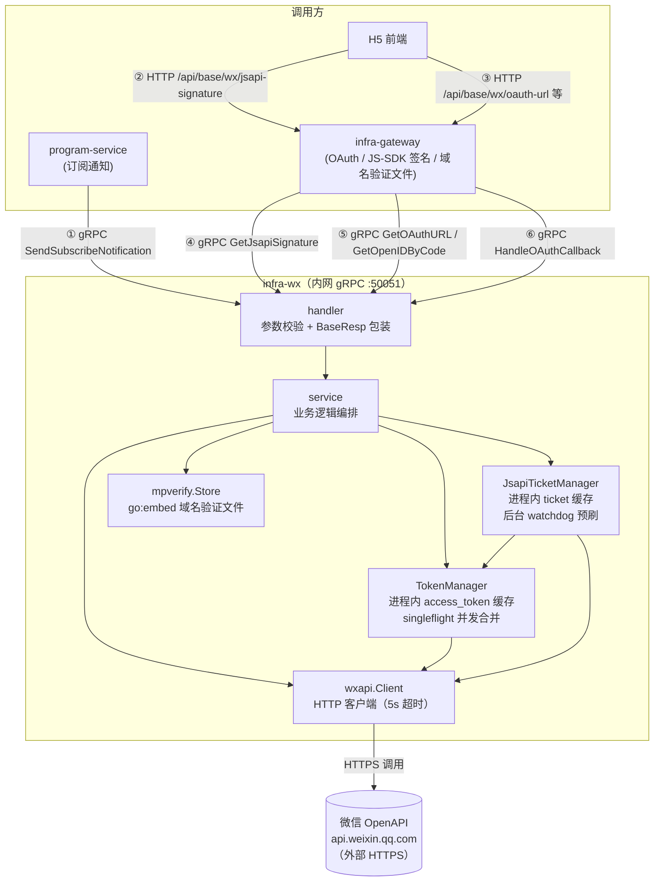
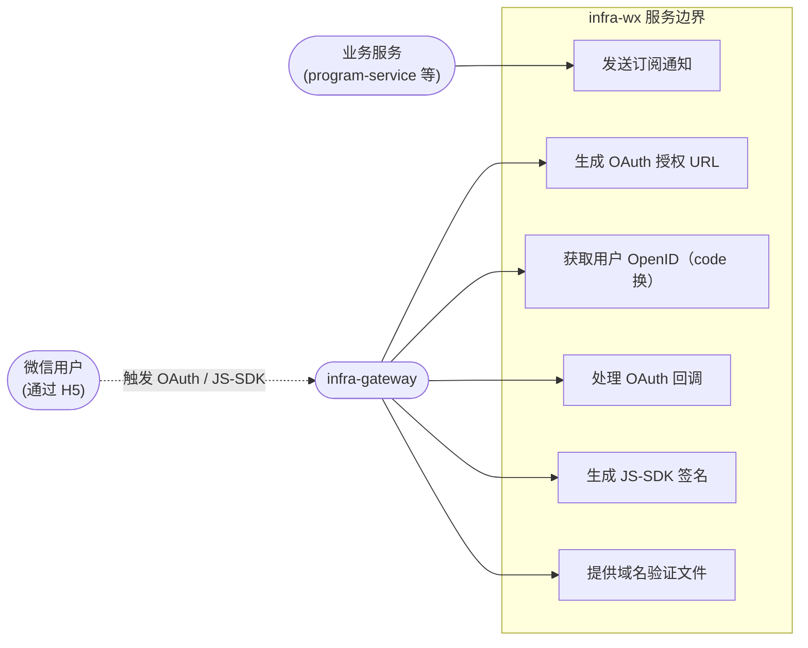
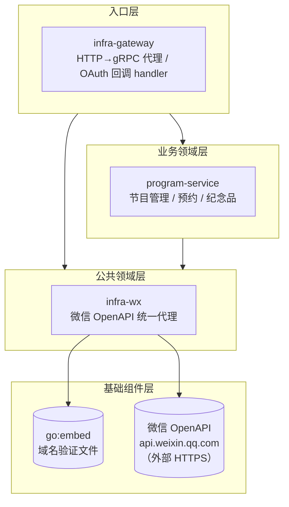
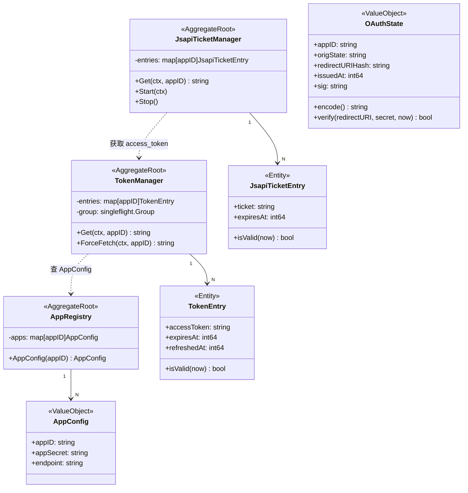
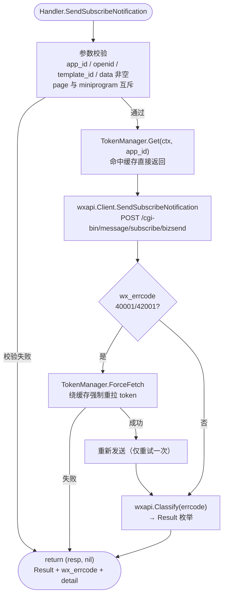
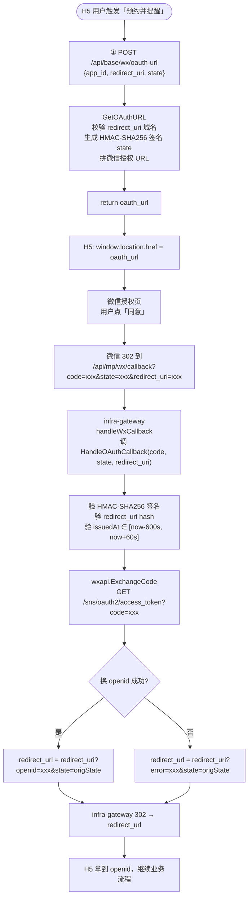
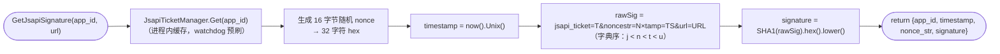

# Technical Design: infra-wx 微信基础设施服务（全量）

> 本文件是 dq-be-tech-design skill 的示例文档，基于 infra-wx 服务的全量功能。
> 与 reservation_memorabilia 示例的区别：本示例展示**无数据库**服务、**进程内缓存**、**外部 HTTP 调用**、**多 RPC 全量 IDL**、**完整 OAuth2 流程**等场景的写法。

## 1. 目标

微信公众号/小程序的 OpenAPI 调用分散在各业务服务中，导致 access_token 多副本互踢、app_secret 到处存放、各业务重复实现 OAuth 流程和 errcode 分类。`infra-wx` 将所有微信 OpenAPI 调用收敛到一个内网 gRPC 服务，向上游业务服务提供语义化的能力接口：

- 订阅通知下发（含 errcode 归一化 + token 失效自动重刷）
- 微信 OAuth2 静默授权（URL 生成 + 回调处理 + openid 获取）
- JS-SDK 签名（jsapi_ticket 缓存 + 签名计算）
- 微信公众平台域名验证文件托管

服务**不含任何业务语义**，不持久化任何数据，不直接对外暴露 HTTP。

## 2. 需要pm或者其它相关方决策和讨论的点

- 无。当前为基础设施能力建设，本 change 暂无需要 PM 或其它相关方继续拍板的事项

## 3. 整体架构

### 服务调用链路图（必须）



**调用时序：**

| # | 调用路径 | 协议 / 路径 | 动作 |
|---|---|---|---|
| ① | program-service → infra-wx | gRPC `SendSubscribeNotification` | 向指定 openid 下发订阅通知；内部自动拿 token + 40001 兜底重刷 |
| ② | H5 → infra-gateway → infra-wx | HTTP `POST /api/base/wx/jsapi-signature` | 获取 JS-SDK config 签名（jsapi_ticket + url + nonce + timestamp）|
| ③ | H5 → infra-gateway → infra-wx | HTTP `POST /api/base/wx/oauth-url` 等 | gateway 做 HTTP→gRPC 转换后转发 |
| ④ | infra-gateway → infra-wx | gRPC `GetJsapiSignature` | 计算签名并返回 {app_id, timestamp, nonce_str, signature} |
| ⑤ | infra-gateway → infra-wx | gRPC `GetOAuthURL` / `GetOpenIDByCode` | 生成授权 URL / 直接用 code 换 openid |
| ⑥ | infra-gateway → infra-wx | gRPC `HandleOAuthCallback` | OAuth 回调处理：验 state 签名 → 换 openid → 返回 redirect_url |

### 用例图



### 系统分层架构图



**服务清单：**

| 服务 | 职责 |
|---|---|
| infra-wx | 微信 OpenAPI 统一代理：订阅通知 / OAuth / JS-SDK 签名 / 域名验证；不含业务语义，不持久化 |
| infra-gateway | HTTP→gRPC 反向代理；OAuth 回调 handler（302 跳转）；域名验证文件透传 |
| program-service | 消费 infra-wx 的 SendSubscribeNotification（gRPC 直连） |

## 4. 服务职责边界

| 组件 | 职责 | 不做什么 |
|---|---|---|
| infra-wx | 所有微信 OpenAPI 调用；access_token / jsapi_ticket 进程内缓存；OAuth state 签名编解码；errcode 归一化 | 不含业务语义；不持久化；不直接暴露 HTTP；不做推送日志记录 |
| infra-gateway | HTTP→gRPC 转换；OAuth 302 跳转；域名验证文件从 infra-wx 透传 | 不做微信 API 直接调用；不解析 openid 含义 |
| 业务服务（program 等）| 决定何时发送通知、发给谁、用哪个模板 | 不直接调微信 OpenAPI；不持有 app_secret |

## 5. 领域实体关系（DDD）

infra-wx 无持久化层，领域模型全部在内存中。



## 6. 领域服务能力（DDD）

### 能力 1：发送微信订阅通知

| 项 | 内容 |
|---|---|
| **能力名** | 发送微信订阅通知 |
| **输入** | `app_id`、`openid`、`template_id`、`data`（多 key 模板变量）、可选 `page`/`miniprogram`/`miniprogram_state`/`lang`/`client_msg_id` |
| **输出** | `Result` 枚举（OK / REJECTED / INVALID_OPENID / RATE_LIMITED / RETRYABLE / INTERNAL）+ 原始 `wx_errcode` + `detail` |
| **前置条件** | `app_id` 在白名单内；`data` 非空；`page` 与 `miniprogram` 互斥 |
| **业务不变量** | token 失效（40001/42001）时自动被动重刷一次，不无限重试；无论微信返回什么 errcode，服务层恒返回 `(resp, nil)`，业务错误由 `Result` 枚举表达 |

### 能力 2：生成微信 OAuth 授权 URL

| 项 | 内容 |
|---|---|
| **能力名** | 生成 OAuth 授权 URL |
| **输入** | `app_id`、`redirect_uri`（必须是 daqian369.com 子域名）、`state`（业务透传） |
| **输出** | `oauth_url`（微信授权跳转完整 URL，含 HMAC-SHA256 签名的 state） |
| **前置条件** | `redirect_uri` 域名白名单校验通过 |
| **业务不变量** | state 编码包含 app_id + 业务 state + redirect_uri hash + 时间戳 + HMAC-SHA256 签名；有效期 10 分钟；签名防伪造和开放重定向 |

### 能力 3：处理 OAuth 回调（换取 openid）

| 项 | 内容 |
|---|---|
| **能力名** | 处理 OAuth 回调 |
| **输入** | `code`（微信授权码）、`state`（签名编码）、`redirect_uri`（回调时的业务 URL） |
| **输出** | `redirect_url`（业务 URL，携带 `?openid=xxx&state=origState` 或错误参数） |
| **前置条件** | state 签名有效、issuedAt 在 [now-600s, now+60s] 范围内、redirect_uri hash 匹配 |
| **业务不变量** | 换 openid 失败时仍返回 redirect_url（携带 error/wx_errcode 参数），不抛 gRPC 错误，不中断用户流程 |

### 能力 4：生成 JS-SDK 签名

| 项 | 内容 |
|---|---|
| **能力名** | 生成 JS-SDK 签名 |
| **输入** | `app_id`、`url`（当前页面完整 URL） |
| **输出** | `{app_id, timestamp, nonce_str, signature}`（JS-SDK config 所需参数） |
| **前置条件** | `app_id` 在白名单内；`url` 非空 |
| **业务不变量** | 签名 = SHA1(字典序拼串)；jsapi_ticket 自动缓存 + watchdog 预刷，调用方无感知 ticket 刷新 |

## 7. 库表设计

无改动。infra-wx 完全无状态服务，不持久化任何数据：
- access_token：进程内 TokenManager 缓存，重启后 lazy 重拉
- jsapi_ticket：进程内 JsapiTicketManager 缓存，后台 watchdog 预刷
- 域名验证文件：go:embed 编译进二进制，不落库

## 8. Proto 契约

IDL 路径：`gitlab.daqian369.com/esm/narnia/idl`
`option go_package = "gitlab.daqian369.com/esm/narnia/idl/gen/go/infra/wx/v1;wxv1"`

文件清单：
- `infra/wx/v1/wx.proto`（全量）— 定义 `InfraWxService` 全部 6 个 RPC + 核心 message / enum

### 7.1 核心 enum 和 message

```protobuf
syntax = "proto3";
package infra.wx.v1;
import "idl/base.proto";

// 发送订阅通知的归一化结果枚举
enum Result {
  RESULT_UNSPECIFIED    = 0;
  RESULT_OK             = 1;  // 成功（wx errcode=0）
  RESULT_REJECTED       = 2;  // 用户已取消订阅（wx errcode=43101）
  RESULT_INVALID_OPENID = 3;  // openid 无效（wx errcode=40003）
  RESULT_RATE_LIMITED   = 4;  // API 超限（wx errcode=45009）
  RESULT_RETRYABLE      = 5;  // 网络故障/超时/token 失效重刷后仍失败
  RESULT_INTERNAL       = 6;  // 其他未分类 errcode，需人工介入
}

message MiniProgram {
  string app_id    = 1;
  string page_path = 2;
}

// 订阅通知请求
message SendSubscribeNotificationRequest {
  string              app_id           = 1;  // 必填，服务号 appid
  string              openid           = 2;  // 必填，接收用户 openid
  string              template_id      = 3;  // 必填，模板 id
  string              page             = 4;  // 可选，H5 跳转 URL（与 miniprogram 互斥）
  MiniProgram         miniprogram      = 5;  // 可选，小程序跳转（与 page 互斥）
  string              miniprogram_state = 6; // 可选，{developer,trial,formal}
  string              lang             = 7;  // 可选，{zh_CN,en_US,zh_HK,zh_TW}
  string              client_msg_id    = 8;  // 可选，幂等键
  map<string, string> data             = 9;  // 必填，模板变量 key→value
  base.BaseReq        base_req         = 255;
}
message SendSubscribeNotificationResponse {
  Result        result     = 1;
  int32         wx_errcode = 2;
  string        detail     = 3;
  base.BaseResp base_resp  = 255;
}

// OAuth URL 生成
message GetOAuthURLRequest {
  string       app_id       = 1;  // 必填
  string       redirect_uri = 2;  // 必填，须是 daqian369.com 子域名
  string       state        = 3;  // 业务透传，原样编进 state 签名
  base.BaseReq base_req     = 255;
}
message GetOAuthURLResponse {
  string        oauth_url = 1;
  base.BaseResp base_resp = 255;
}

// code 直接换 openid
message GetOpenIDByCodeRequest {
  string       app_id   = 1;
  string       code     = 2;
  base.BaseReq base_req = 255;
}
message GetOpenIDByCodeResponse {
  string        openid     = 1;
  int32         wx_errcode = 2;
  string        detail     = 3;
  base.BaseResp base_resp  = 255;
}

// OAuth 回调处理
message HandleOAuthCallbackRequest {
  string       code         = 1;
  string       state        = 2;  // HMAC 签名的 state
  string       redirect_uri = 3;  // 业务跳转目标 URL
  base.BaseReq base_req     = 255;
}
message HandleOAuthCallbackResponse {
  string        redirect_url = 1;  // 带 openid/error 参数的完整 URL
  base.BaseResp base_resp    = 255;
}

// JS-SDK 签名
message GetJsapiSignatureRequest {
  string       app_id   = 1;
  string       url      = 2;  // 当前页面完整 URL（含 query，不含 #fragment）
  base.BaseReq base_req = 255;
}
message GetJsapiSignatureResponse {
  string        app_id     = 1;
  int64         timestamp  = 2;
  string        nonce_str  = 3;
  string        signature  = 4;
  base.BaseResp base_resp  = 255;
}

// 域名验证文件
message GetMPVerifyFileRequest {
  string       filename = 1;  // 仅允许 [a-zA-Z0-9_.-]+\.txt 格式
  base.BaseReq base_req = 255;
}
message GetMPVerifyFileResponse {
  string        content  = 1;
  base.BaseResp base_resp = 255;
}
```

### 7.2 InfraWxService RPC 注册（HTTP 路径绑定）

```protobuf
service InfraWxService {
  // 订阅通知（纯 gRPC，不暴露 HTTP，上游业务服务直连）
  rpc SendSubscribeNotification (SendSubscribeNotificationRequest)
      returns (SendSubscribeNotificationResponse);

  // OAuth：H5 发起 → infra-gateway HTTP→gRPC 转发
  rpc GetOAuthURL (GetOAuthURLRequest) returns (GetOAuthURLResponse) {
    option (google.api.http) = { post: "/api/base/wx/oauth-url" body: "*" };
  }
  rpc GetOpenIDByCode (GetOpenIDByCodeRequest) returns (GetOpenIDByCodeResponse) {
    option (google.api.http) = { post: "/api/base/wx/openid-by-code" body: "*" };
  }

  // OAuth 回调：infra-gateway 自定义 HTTP handler → gRPC，302 跳转由 gateway 处理
  rpc HandleOAuthCallback (HandleOAuthCallbackRequest) returns (HandleOAuthCallbackResponse);

  // JS-SDK 签名：业务服务直调 or gateway 转发
  rpc GetJsapiSignature (GetJsapiSignatureRequest) returns (GetJsapiSignatureResponse) {
    option (google.api.http) = { post: "/api/base/wx/jsapi-signature" body: "*" };
  }

  // 域名验证文件：gateway 拦截 GET /xxx.txt 转发
  rpc GetMPVerifyFile (GetMPVerifyFileRequest) returns (GetMPVerifyFileResponse);
}
```

## 9. 状态机

无改动 — 本 change 不涉及状态机。

## 10. 核心流程

### 订阅通知下发（含 token 失效兜底）



### OAuth2 静默授权完整流程



### JS-SDK 签名生成



## 11. 服务启动

```
main()
  │
  ├─ 1. logutil.Setup("infra-wx")          # 结构化日志 + OTEL 链路追踪
  │
  ├─ 2. cfg := wx.LoadConfig(os.Getenv)    # 环境变量解析
  │       ├─ RUNTIME_ENV → OAuth callback host
  │       ├─ WX_APPS_CONFIG（JSON 数组）→ []AppConfig
  │       ├─ INFRA_WX_GRPC_ADDR（默认 :50051）
  │       ├─ WX_API_ENDPOINT（默认 https://api.weixin.qq.com）
  │       └─ WX_TOKEN_REFRESH_LEAD_SECONDS（默认 600，clamp [60,3600]）
  │
  ├─ 3. 构建组件有向图（依赖顺序）：
  │       ├─ client    := wxapi.NewClient(cfg)
  │       ├─ tokens    := wxapi.NewTokenManager(cfg.Apps, client)
  │       ├─ jsTickets := jsapitickets.NewJsapiTicketManager(cfg.Apps, tokens, client, cfg.LeadSeconds)
  │       │   └─ jsTickets.Start(ctx)      # 启动 watchdog goroutine（每 app 一条）
  │       ├─ registry  := wx.NewAppRegistry(cfg.Apps)
  │       ├─ svc       := wx.NewService(tokens, client, registry, cfg.OAuthCallbackBaseURL)
  │       │   └─ wx.WithJsapiTickets(svc, jsTickets)  # 注入 ticket provider
  │       └─ mpStore   := mpverify.NewStore()          # 加载 go:embed 文件，失败则 panic
  │
  ├─ 4. handler := wx.NewHandler(svc, mpStore)
  │
  ├─ 5. grpcSrv := grpcutil.NewServer()
  │       └─ wxv1.RegisterInfraWxServiceServer(grpcSrv, handler)
  │       └─ reflection.Register(grpcSrv)   # gRPC reflection（开发调试）
  │
  ├─ 6. lis, _ := net.Listen("tcp", cfg.GRPCAddr)
  │       go grpcSrv.Serve(lis)
  │
  └─ 7. 优雅关闭（SIGINT / SIGTERM）：
          grpcSrv.GracefulStop() → jsTickets.Stop()
```

**启动依赖顺序**：client → tokens → jsTickets → registry → svc → handler → gRPC server

## 12. 服务目录结构（服务内部代码架构）

对照 `dq-be-code-structure` 规范，按 `handler / interceptor / worker / domain_service / model / repository / infra / consts` 分层。infra-wx 为无状态服务（无库表），故无 `repository/db/`、无 `biz_service/`（所有 RPC 均为单 domain_service 调用，满足可跳过条件）。

jsapi_ticket 定时预刷是典型的定时任务接入层，watchdog goroutine（"什么时候触发"的调度逻辑）归 `worker/cron/`，实际刷新逻辑（"触发后做什么"）保留在 `domain_service/wx_jsapi_domain_service.go`，与 gRPC handler 复用同一套领域能力。watchdog 与 gRPC server 同进程运行，无需独立 `cmd/worker/` 二进制。

```
infra-wx/
├── cmd/infra-wx/
│   └── main.go
└── internal/
    ├── handler/                          # gRPC 接入层，每 RPC 一文件
    │   ├── handler.go
    │   ├── send_subscribe_notification.go
    │   ├── get_jsapi_signature.go
    │   ├── get_oauth_url.go
    │   ├── get_open_id_by_code.go
    │   ├── handle_oauth_callback.go
    │   └── get_mp_verify_file.go
    ├── interceptor/
    │   └── validation.go                 # proto-validate 自动校验
    ├── worker/
    │   └── cron/
    │       └── jsapi_ticket_watchdog.go  # jsapi_ticket 定时预刷调度
    ├── domain_service/                   # 核心业务逻辑
    │   ├── wx_token_domain_service.go    # singleflight + 被动重刷
    │   ├── wx_jsapi_domain_service.go    # ticket 缓存 + JS-SDK 签名
    │   ├── wx_oauth_domain_service.go    # OAuth state + URL + code 兑换
    │   └── wx_notify_domain_service.go   # 订阅通知编排
    ├── model/
    │   └── wx.go                         # 内存领域模型
    ├── repository/
    │   └── rpc/
    │       └── wx_api_client.go          # 微信 OpenAPI HTTP client
    ├── infra/
    │   ├── config.go                     # 环境变量 + AppRegistry 单例
    │   └── mpverify.go                   # go:embed 文件映射
    └── consts/
        └── wx.go                         # 枚举白名单 + errcode 分类表
```

**各层职责说明：**

| 路径 | 职责 |
|---|---|
| `cmd/infra-wx/main.go` | 入口：infra 初始化 + cron worker 启动 + grpcutil.NewServer |
| `handler/handler.go` | Handler struct + NewHandler()；持有各 domain_service 引用 |
| `interceptor/validation.go` | proto-validate 自动校验，注册到 grpcutil.NewServer |
| `worker/cron/jsapi_ticket_watchdog.go` | 调度接入层：sleep until `expiresAt - leadSeconds` → 调 `RefreshJsapiTicket` |
| `domain_service/wx_token_domain_service.go` | access_token 进程内缓存；singleflight 防并发；40001/42001 被动重刷 |
| `domain_service/wx_jsapi_domain_service.go` | jsapi_ticket 缓存；`RefreshJsapiTicket`（被 watchdog 和 Get 调用）；SHA1 签名生成 |
| `domain_service/wx_oauth_domain_service.go` | OAuthState HMAC-SHA256 编解码；OAuth URL 构造；code 换 openid |
| `domain_service/wx_notify_domain_service.go` | 订阅通知编排：get token → 构造请求体 → call wx API → errcode 归一化 |
| `model/wx.go` | AppConfig / TokenEntry / JsapiTicketEntry / OAuthState（纯内存，无 gorm tag） |
| `repository/rpc/wx_api_client.go` | 微信 OpenAPI HTTP client：FetchToken / ExchangeCode / Send / FetchJsapiTicket |
| `infra/config.go` | 环境变量解析；AppRegistry 单例（appID → AppConfig） |
| `infra/mpverify.go` | go:embed 域名验证文件；filename → content 只读映射 |
| `consts/wx.go` | miniprogram_state / lang 枚举白名单；errcode → Result 分类表 |


## 13. 错误码规范

| code | HTTP | 语义 |
|---|---|---|
| `ErrInfraWxSendSubscribeNotificationInvalidParameter` | 400 | 参数校验失败（非空 / 互斥 / 白名单） |
| `ErrInfraWxSendSubscribeNotificationUnavailable` | 503 | token 获取失败或 HTTP 层不可达 |
| `ErrInfraWxGetOAuthURLInvalidParameter` | 400 | redirect_uri 域名不在白名单 |
| `ErrInfraWxGetOAuthURLInternalFatal` | 500 | app_id 不存在或 state 编码失败 |
| `ErrInfraWxGetOpenIDByCodeInvalidParameter` | 400 | app_id / code 为空 |
| `ErrInfraWxGetOpenIDByCodeUnavailable` | 503 | 微信 API 不可达 |
| `ErrInfraWxHandleOAuthCallbackInvalidParameter` | 400 | state 签名验证失败 / 超期 / redirect_uri hash 不匹配 |
| `ErrInfraWxGetJsapiSignatureInvalidParameter` | 400 | app_id / url 为空 |
| `ErrInfraWxGetJsapiSignatureUnavailable` | 503 | ticket 获取失败 |
| `ErrInfraWxGetMPVerifyFileNotFound` | 404 | filename 不存在于 embed 文件集 |

> 微信侧业务错误（REJECTED / INVALID_OPENID 等）**不走 gRPC error**，通过 `Result` 枚举 + `BaseResp` 透出，调用方根据 `Result` 决定是否重试/告警。

## 14. 日志规范

日志工具使用规范见 `dq-be-libs` §2.3。本 change 关键事件：

| event | 级别 | 关键字段 | 说明 |
|---|---|---|---|
| `infrawx.subscribe_send` | INFO | app_id, template_id, openid_tail（末6位）, data_keys | 入口埋点 |
| `infrawx.subscribe_result` | INFO | app_id, result, wx_errcode, retried, latency_ms | 结果统计，监控用 |
| `infrawx.token_forced_refresh` | WARN | app_id, trigger_errcode | 40001/42001 被动重刷，频繁则告警 |
| `infrawx.oauth_callback_result` | INFO | app_id, has_openid, wx_errcode | OAuth 回调结果 |
| `infrawx.jsapi_signature_result` | INFO | app_id, url_host, has_signature, duration_ms | 签名结果 |
| `infrawx.wx_api.fail` | ERROR | api, app_id, duration_ms, reason | HTTP 层故障 |

**脱敏约定**：openid 仅保留末 6 位；access_token / app_secret / code / state 不落日志。

## 15. 监控 / 告警

| 指标 | 类型 | 维度 | 告警阈值 |
|---|---|---|---|
| `infrawx_subscribe_result_total` | Counter | app_id, result | `result=RATE_LIMITED` 连续 10 次 → 告警 |
| `infrawx_token_forced_refresh_total` | Counter | app_id | 1 分钟内 > 5 次 → 告警（疑似 token 轮换风暴） |
| `infrawx_wx_api_latency_ms` | Histogram | api | P99 > 3000ms → 告警 |
| `infrawx_wx_api_fail_total` | Counter | api | 1 分钟内 > 10 次 → 告警 |
| gRPC 请求延迟 / 错误率 | Histogram/Counter | rpc | 由 common-sdk/grpcutil 默认提供 |

## 16. 数据迁移

无改动。服务完全无状态，无库表，无存量数据处理。

## 17. 兼容性 / 灰度 / 回滚

**向后兼容**：新增 RPC 不影响已有 RPC；`SendSubscribeNotification` 替换 `SendOneTimeSubscribeMessage` 为 BREAKING change，按以下步骤灰度：
1. 先上线 infra-wx（新 RPC 就绪，旧 RPC 同时存在）
2. 再逐服务迁移调用方（program-service 等）切换到新 RPC
3. 所有调用方切换完毕后，下线旧 RPC

**回滚**：infra-wx 无状态，回滚只需切换镜像版本；access_token lazy 重拉，重启无副作用。

## 18. 部署

| 配置项 | 值 |
|---|---|
| gRPC 端口 | `:50051`（内网，不对外） |
| 副本数 | ≥ 2（保证高可用，多副本间 token 偶发互踢由 40001 兜底） |
| 资源预估 | CPU 0.1c / MEM 64Mi（极低，纯内存缓存 + HTTP 代理） |
| Secret | `WX_APPS_CONFIG`（含 app_secret，走 K8s Secret） |

**环境变量：**

| 变量 | 默认值 | 说明 |
|---|---|---|
| `RUNTIME_ENV` | 必填 | `prod` / `test`，决定 OAuth callback host |
| `WX_APPS_CONFIG` | 必填 | JSON 数组，每条含 app_id / app_secret / endpoint（可选） |
| `INFRA_WX_GRPC_ADDR` | `:50051` | gRPC 监听地址 |
| `WX_API_ENDPOINT` | `https://api.weixin.qq.com` | 微信 API 根（测试替换用） |
| `WX_TOKEN_REFRESH_LEAD_SECONDS` | `600` | jsapi_ticket watchdog 预刷 lead time，clamp [60,3600] |

## 19. 风险 & 兜底

| 风险 | 应对 |
|---|---|
| access_token 多副本互踢（40001） | 被动检测 + ForceFetch 重刷一次，已在核心流程兜底；stable_token 协议服务端协调可大幅降低互踢频率 |
| 微信 API 限流（45009） | Result=RATE_LIMITED 透出，上游自行判断是否重试；不在 infra-wx 侧重试（避免放大效应） |
| jsapi_ticket watchdog goroutine 泄漏 | `Start/Stop` 生命周期绑定 context + WaitGroup，GracefulStop 时等待 watchdog 退出 |
| OAuth state 伪造 / 开放重定向 | HMAC-SHA256 签名 + redirect_uri hash 双重验证；有效期 10 分钟防重放 |
| go:embed 域名验证文件更新需重新部署 | 当前文件内容稳定（年级变更），接受重新部署的代价 |
| 微信 API 全局不可达 | 调用方收到 RETRYABLE，自行决定降级逻辑（订阅通知失败不阻断预约主流程） |

## 20. 不在本设计范围

- 微信支付 / 客服消息 / 素材管理 / 用户信息接口
- 推送日志持久化（由上游业务服务负责记录）
- 配置热更新（SIGHUP reload）— 当前走 Pod 重启
- 分布式 access_token 锁（Redis）— 量级不需要，待规模化时考虑
- 推送限流 / 熔断（由 common-sdk 基础设施层提供）

## 21. 参考 / 相关文档

- openspec changes: `narnia/infra-wx/openspec/changes/archive/`
  - `add-infra-wx-subscribe-message`（MVP）
  - `add-wx-silent-oauth`（OAuth2 + 域名验证）
- `replace-subscribe-message-with-notification`（BREAKING，当前进行中）
- `add-infra-wx-jsapi-signature`（JS-SDK 签名）

## 22. todo事项

- `GetMPVerifyFile` 是否需要注册为 gRPC RPC + HTTP 绑定，还是只在 infra-gateway 侧直接读取（当前是 gRPC 方式）
- 多副本 token 互踢频率上升后是否引入 Redis 分布式锁 — 待观察 `infrawx_token_forced_refresh_total` 指标

## 23. 变更点核心记录

| # | 变更点名 | 时间 | commit_id | 变动摘要 | reviewer |
|---|---|---|---|---|---|
| 1 | 初稿 | 2026-04-22 | a5c3e92 | 初稿：全量 OpenAPI 代理 + TokenManager / JsapiTicketManager 进程内缓存 + OAuth2 state HMAC 签名 | @me |
| 2 | token 重试上限 | 2026-04-29 | d8f4b10 | §10 补 token 40001/42001 被动重刷的重试次数上限（单次）；§15 补 `infrawx_token_forced_refresh_total` 指标；§19 新增风险"多副本 token 互踢" | @colleague |
