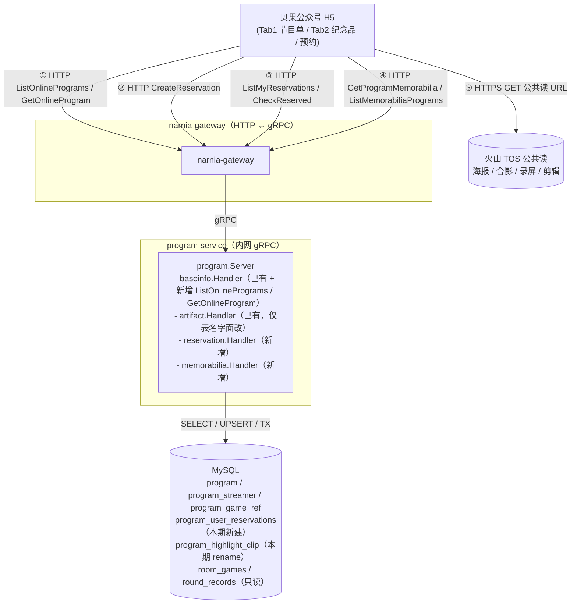
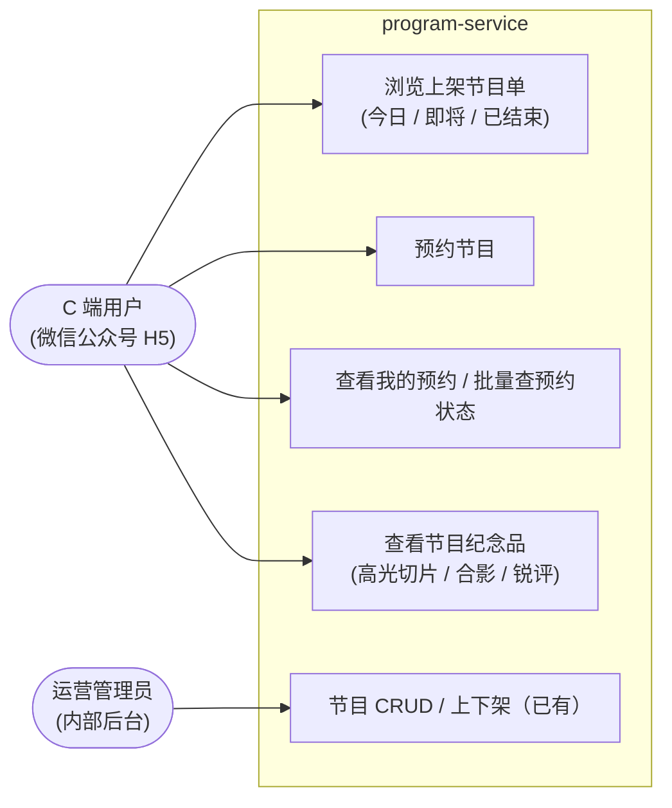
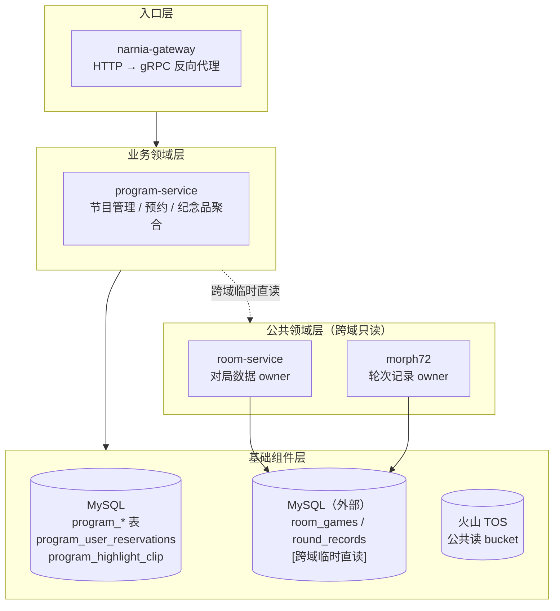
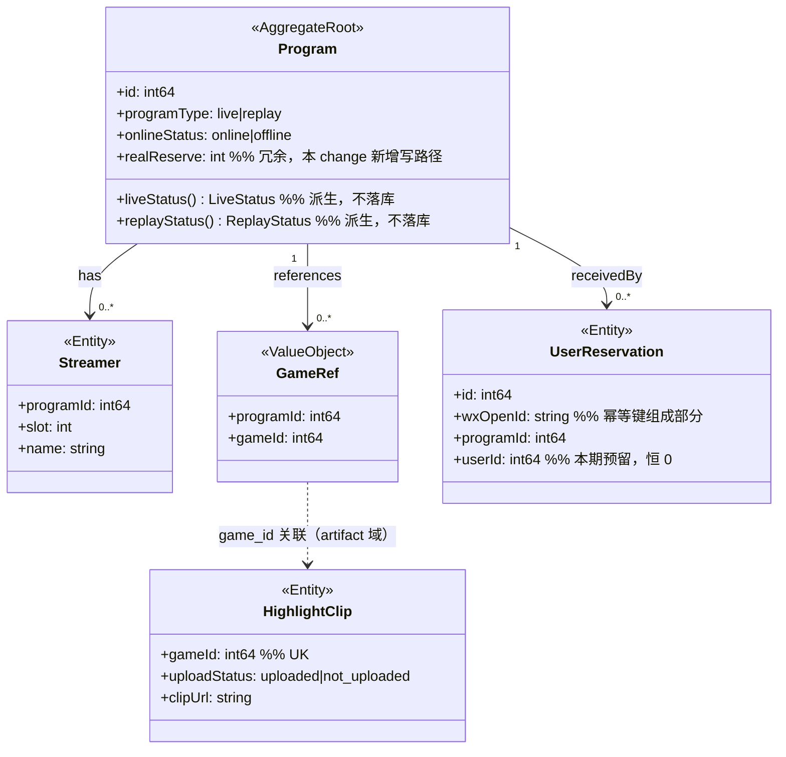
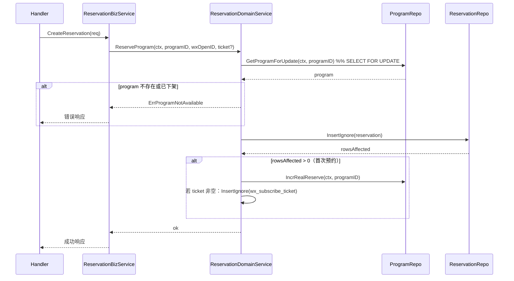

# Technical Design: 节目预约 + 纪念品 + C 端只读

> 对应 change：`c-20260416-add-program-reservation-memorabilia`
> 本文件是 dq-be-tech-design skill 的示例文档，展示 23 节模板在真实需求中的填写方式。
> 重点示范：§3 架构图分层、§5 DDD 实体建模、§6 领域能力语义、§7 库表归属分类、§10 核心流程。

## 1. 目标

`program` 服务已有运营后台 CRUD 能力（baseinfo 9 RPC + artifact 3 RPC），但缺 C 端入口。本 change 新增三条领域能力，支撑贝果公众号 H5 的三个核心 Tab：

- **节目单 Tab**：上架节目列表（今日 / 即将 / 已结束过滤）+ 节目详情，挂在 `baseinfo` 领域读能力延伸下
- **预约 Tab**：用户对节目下预约（幂等、不可取消）；同事务同步 `program.real_reserve`
- **纪念品 Tab**：已结束节目的高光切片 + 合影 + 锐评聚合，跨 baseinfo / artifact 只读

同步借未上线窗口把 `highlight_clip` 表 rename 为 `program_highlight_clip`，统一 `program_*` 表前缀。

## 2. 需要pm或者其它相关方决策和讨论的点

- 无。当前业务边界已由 PRD 明确，本 change 暂无需要 PM 或其它相关方继续拍板的事项

## 3. 整体架构

### 服务调用链路图（必须）



**调用时序：**

| # | 调用路径 | 协议 / 路径 | 动作 |
|---|---|---|---|
| ① | FE → gateway → program | `POST /api/narnia/program/base-info/list-online` 或 `/get-online` | 按今日/即将/已结束过滤上架节目，或按 ID 取详情 |
| ② | FE → gateway → program | `POST /api/narnia/program/reservation/create` | 入参 `{program_id, wx_open_id, wx_union_id}`；同事务 INSERT reservation + UPDATE real_reserve +1 |
| ③ | FE → gateway → program | `POST /api/narnia/program/reservation/list` 或 `/check` | 查我的预约列表，或批量回显预约状态 `map<program_id, bool>` |
| ④ | FE → gateway → program | `POST /api/narnia/program/memorabilia/detail` 或 `/list` | 跨域聚合：读 room_games + round_records + program_highlight_clip 组装纪念品 |
| ⑤ | FE → TOS | `HTTPS GET public_url` | 直接下载/预览海报、合影、录屏、剪辑 |

### 用例图



### 系统分层架构图



**服务清单：**

| 服务 | 职责 |
|---|---|
| program-service | 节目全生命周期管理：运营后台 CRUD + C 端只读 + 用户预约 + 纪念品聚合 |
| narnia-gateway | HTTP → gRPC 反向代理，路由按领域前缀分发 |
| room-service | 对局数据 owner（room_games），本 change 仅只读 |
| morph72 | 轮次记录 owner（round_records），本 change 仅只读 |

## 4. 服务职责边界

无改动。本 change 全在 `program-service` 内新增领域包，无新服务、无服务边界调整。

## 5. 领域实体关系（DDD）



> `memorabilia` 聚合（只读视角）：以 `Program` 为根，通过 `GameRef` 关联 `room_games`（外部实体），再关联 `round_records` 和 `HighlightClip`。外部实体不参与本服务聚合边界，仅做只读关联。

## 6. 领域服务能力（DDD）

### 能力 1：用户预约节目

| 项 | 内容 |
|---|---|
| **能力名** | 用户预约节目 |
| **输入** | `wx_open_id`（必填）、`program_id`、`wx_union_id`（选填）、`wx_subscribe_ticket`（选填，含 template_id + scene） |
| **输出** | 成功（含幂等成功）；失败：节目不存在 / 节目已下架 |
| **前置条件** | 节目 `online_status = online`；`wx_open_id` 非空 |
| **业务不变量** | 同一 `wx_open_id` 对同一 `program_id` 至多存在一条预约记录（UK 保证）；`real_reserve` 仅在首次预约成功时 +1（幂等时不重复计） |

### 能力 2：查询节目纪念品

| 项 | 内容 |
|---|---|
| **能力名** | 查询节目纪念品 |
| **输入** | `program_id` |
| **输出** | 节目元信息 + 按 game_id 聚合的 rounds（合影 / 锐评 / 录屏 / 分数图）+ 高光切片（0..1） |
| **前置条件** | 节目存在且已结束（`LiveStatus = ENDED_DONE`） |
| **业务不变量** | 聚合结果跨 baseinfo / artifact / 外部服务只读组合，不写任何状态；外部表 NULL 字段容错转空字符串 |

### 能力 3：C 端浏览节目单

| 项 | 内容 |
|---|---|
| **能力名** | C 端浏览上架节目 |
| **输入** | `filter`（today / upcoming / ended）、游标分页（`cursor + size`） |
| **输出** | 上架节目列表（含派生的 LiveStatus / ReplayStatus、预约人数冗余值） |
| **前置条件** | 无鉴权（C 端公开） |
| **业务不变量** | 仅返回 `online_status = online` 的节目；派生状态在内存计算，不落库 |

## 7. 库表设计

### 新建表

#### `program_user_reservations`

```sql
CREATE TABLE `program_user_reservations` (
  `id`            BIGINT UNSIGNED NOT NULL AUTO_INCREMENT PRIMARY KEY,
  `user_id`       BIGINT       NOT NULL DEFAULT 0  COMMENT '本期预留，恒写 0；openid→user_id 映射落地后回填启用',
  `wx_open_id`    VARCHAR(64)  NOT NULL             COMMENT '微信公众号 open_id，幂等键组成部分，不可为空',
  `wx_union_id`   VARCHAR(64)  NOT NULL DEFAULT ''  COMMENT '微信 union_id，冗余预留',
  `program_id`    BIGINT       NOT NULL             COMMENT '被预约节目 ID',
  `created_at_ms` BIGINT       NOT NULL,
  `updated_at_ms` BIGINT       NOT NULL,
  UNIQUE KEY `uk_wx_open_program` (`wx_open_id`, `program_id`),
  KEY `idx_program_id`  (`program_id`),
  KEY `idx_wx_union_id` (`wx_union_id`)
) ENGINE=InnoDB DEFAULT CHARSET=utf8mb4
  COMMENT='用户节目预约关系：幂等不可取消';
```

设计要点：
- 无 `deleted_at_ms`：业务明确预约不可撤回，永不删永不改
- `UK(wx_open_id, program_id)` 支撑幂等插入（`INSERT IGNORE`），`RowsAffected=0` 视为幂等成功
- `user_id DEFAULT 0` 预留，本期 handler 层拒绝空 `wx_open_id` 双重保证 UK 有效

### 修改表

#### `program`（本服务 owner，新增写路径，无结构变更）

```sql
CREATE TABLE `program` (
  `id`            BIGINT       NOT NULL AUTO_INCREMENT PRIMARY KEY,
  `program_type`  VARCHAR(16)  NOT NULL COMMENT 'live / replay',
  `name`          VARCHAR(128) NOT NULL,
  `platform`      VARCHAR(16)  NOT NULL COMMENT 'douyin / bilibili / kuaishou',
  `start_at_ms`   BIGINT       NOT NULL DEFAULT 0,
  `end_at_ms`     BIGINT       NOT NULL DEFAULT 0,
  `visible_at_ms` BIGINT       NOT NULL DEFAULT 0  COMMENT '仅 replay 使用',
  `live_url`      VARCHAR(512) NOT NULL DEFAULT '',
  `replay_url`    VARCHAR(512) NOT NULL DEFAULT '',
  `poster_url`    VARCHAR(512) NOT NULL DEFAULT '',
  `weight`        INT          NOT NULL DEFAULT 0,
  `real_reserve`  INT          NOT NULL DEFAULT 0  COMMENT '预约人数冗余；本 change 新增写路径：CreateReservation 首次成功时同事务 +1',
  `online_status` VARCHAR(8)   NOT NULL DEFAULT 'offline' COMMENT 'online / offline',
  `creator_uid`   BIGINT       NOT NULL,
  `created_at_ms` BIGINT       NOT NULL,
  `updated_at_ms` BIGINT       NOT NULL,
  `deleted_at_ms` BIGINT       NOT NULL DEFAULT 0,
  KEY `idx_type_start`   (`program_type`, `start_at_ms`),
  KEY `idx_type_visible` (`program_type`, `visible_at_ms`)
) ENGINE=InnoDB DEFAULT CHARSET=utf8mb4 COMMENT='节目主表：直播/录播共用';
```

本 change 变更：仅新增写路径，`real_reserve` 列已存在，无 DDL 变更。`migrations/` 无新文件。

#### `program_highlight_clip`（rename 自 `highlight_clip`，无结构变更）

服务未上线，无存量数据，直接修改 `migrations/002_highlight_clip.sql` 的 CREATE TABLE 表名，不写 `RENAME TABLE` 脚本。

```sql
CREATE TABLE `program_highlight_clip` (
  `id`                   BIGINT UNSIGNED NOT NULL AUTO_INCREMENT PRIMARY KEY,
  `game_id`              BIGINT UNSIGNED NOT NULL COMMENT '关联 room_games.game_id',
  `upload_status`        VARCHAR(16)  NOT NULL DEFAULT 'not_uploaded' COMMENT 'uploaded|not_uploaded',
  `clip_object_key`      VARCHAR(128) NOT NULL DEFAULT '' COMMENT 'infra-asset 返回的 TOS object key',
  `clip_url`             VARCHAR(1024) NOT NULL DEFAULT '' COMMENT 'TOS 公共读完整 URL',
  `clip_file_name`       VARCHAR(256) NOT NULL DEFAULT '',
  `clip_file_size_bytes` BIGINT       NOT NULL DEFAULT 0,
  `uploaded_at_ms`       BIGINT       NOT NULL DEFAULT 0,
  `created_at_ms`        BIGINT       NOT NULL,
  `updated_at_ms`        BIGINT       NOT NULL,
  UNIQUE KEY `uk_program_highlight_clip_game` (`game_id`)
) ENGINE=InnoDB DEFAULT CHARSET=utf8mb4
  COMMENT='对局精彩剪辑：挂在 game_id 上的附属资源';
```

### 跨领域/服务的表（临时直接读）[跨域临时]

以下两张表由外部服务 owner，理论上应通过对应服务 RPC 访问；当前考虑开发成本，`memorabilia` 域直接只读，须标注 `[跨域临时]`，后续纳入技术债偿还。

#### `room_games` — owner: room-service

本 change 消费字段：`game_id` / `game_type` / `status` / `created_at_ms`。

```sql
CREATE TABLE `room_games` (
  `id`            BIGINT UNSIGNED NOT NULL AUTO_INCREMENT PRIMARY KEY,
  `room_id`       BIGINT UNSIGNED NOT NULL COMMENT '所属 rooms.id',
  `game_id`       BIGINT UNSIGNED NOT NULL COMMENT 'game 业务 ID',
  `game_seq`      INT UNSIGNED    NOT NULL COMMENT '该 room_id 下的 game 序号',
  `game_type`     VARCHAR(64)     NOT NULL COMMENT '玩法类型，如 morph72',
  `status`        VARCHAR(32)     NOT NULL COMMENT 'STARTING|ACTIVE|FAILED|FINISHED',
  `created_at_ms` BIGINT          NOT NULL,
  `updated_at_ms` BIGINT          NOT NULL,
  UNIQUE KEY `uk_room_games_game_id`       (`game_id`),
  UNIQUE KEY `uk_room_games_room_game_seq` (`room_id`, `game_seq`),
  KEY `idx_room_games_room_status`         (`room_id`, `status`)
) ENGINE=InnoDB DEFAULT CHARSET=utf8mb4 COMMENT='room 与 game 绑定表';
```

#### `round_records` — owner: morph72

本 change 新增消费字段：`group_photo_url`（TEXT NULL，读取时 `sql.NullString` 容错转空字符串）。

```sql
CREATE TABLE `round_records` (
  `id`               BIGINT UNSIGNED  NOT NULL AUTO_INCREMENT PRIMARY KEY,
  `game_id`          BIGINT UNSIGNED  NOT NULL COMMENT '游戏局 ID',
  `round`            INT              NOT NULL COMMENT '轮次',
  `topic_id`         BIGINT           NULL     COMMENT '该轮题目 ID',
  `player_user_id`   BIGINT           NOT NULL COMMENT '玩家 UID',
  `player_user_name` VARCHAR(255)     NULL     COMMENT '玩家昵称，冻结自 score 请求',
  `score_image_url`  TEXT             NULL     COMMENT '该玩家本轮送评图 URL',
  `score_comment`    TEXT             NULL     COMMENT '该玩家本轮锐评文案',
  `round_score`      INT              NULL     COMMENT '该玩家本轮评分',
  `recording_url`    TEXT             NULL     COMMENT '本轮录屏 MP4 对象路径',
  `user_intent`      VARCHAR(64)      NULL,
  `group_photo_url`  TEXT             NULL     COMMENT '该轮合照 URL',
  `score_request_id` VARCHAR(128)     NULL,
  `photo_request_id` VARCHAR(128)     NULL,
  `created_at`       DATETIME(3)      NOT NULL,
  `updated_at`       DATETIME(3)      NOT NULL,
  UNIQUE KEY `uk_game_round_player` (`game_id`, `round`, `player_user_id`),
  KEY `idx_game_round`       (`game_id`, `round`),
  KEY `idx_score_request_id` (`score_request_id`),
  KEY `idx_photo_request_id` (`photo_request_id`)
) ENGINE=InnoDB DEFAULT CHARSET=utf8mb4 COMMENT='morph72 每局每轮每位玩家的送评结果记录';
```

## 8. Proto 契约

IDL 路径：`gitlab.daqian369.com/esm/narnia/idl`
`option go_package = "gitlab.daqian369.com/esm/narnia/idl/gen/go/narnia/program/v1;programv1"`

文件清单：
- `narnia/program/v1/base_info.proto`（修改）— 新增 `ProgramStatusFilter` enum + `ListOnlinePrograms` / `GetOnlineProgram` 两个 RPC 消息
- `narnia/program/v1/artifact.proto`（修改）— `PlayerMaterial` 新增 `group_photo_url` 字段
- `narnia/program/v1/reservation.proto`（新建）— 3 个 RPC 的 request/response；列表项复用 `Program`
- `narnia/program/v1/memorabilia.proto`（新建）— 2 个 RPC 的 request/response；完全复用 `Program` / `GameDetail`
- `narnia/program/v1/program.proto`（修改）— 在 `ProgramService` 注册 7 个新 RPC

### 7.1 base_info.proto（修改）

```protobuf
enum ProgramStatusFilter {
  PROGRAM_STATUS_FILTER_UNSPECIFIED = 0;
  PROGRAM_STATUS_FILTER_ALL      = 1;
  PROGRAM_STATUS_FILTER_TODAY    = 2;
  PROGRAM_STATUS_FILTER_UPCOMING = 3;
  PROGRAM_STATUS_FILTER_ENDED    = 4;
}

message ListOnlineProgramsRequest {
  ProgramStatusFilter program_status_filter = 1;
  string              cursor                = 2;  // 不透明 base64，空 = 从头
  int32               size                  = 3;  // 1-100，默认 20
  base.BaseReq        base_req              = 255;
}
message ListOnlineProgramsResponse {
  repeated Program items       = 1;
  string           next_cursor = 2;  // 空 = 末尾
  base.BaseResp    base_resp   = 255;
}

message GetOnlineProgramRequest  { int64 program_id = 1; base.BaseReq base_req = 255; }
message GetOnlineProgramResponse { Program program = 1; base.BaseResp base_resp = 255; }
```

### 7.2 artifact.proto（修改，新增字段）

```protobuf
message PlayerMaterial {
  int64  user_id              = 1;
  string nickname             = 2;
  string avatar_url           = 3;
  int32  seat_no              = 4;
  string prompt_text          = 5;
  string image_url            = 6;
  string review_text          = 7;
  int32  round_score          = 8;
  string screen_recording_url = 9;
  string group_photo_url      = 10;  // 新增：round_records.group_photo_url（合影留念）
}
```

### 7.3 reservation.proto（新建）

```protobuf
syntax = "proto3";
package narnia.program.v1;
import "idl/base.proto";
import "idl/narnia/program/v1/base_info.proto";  // 复用 Program

message ReservedProgramItem {
  Program program        = 1;
  int64   reserved_at_ms = 2;
}

message CreateReservationRequest {
  int64        program_id  = 1;  // 必填非零
  string       wx_open_id  = 2;  // 必填非空；幂等键
  string       wx_union_id = 3;  // 可选
  base.BaseReq base_req    = 255;
}
message CreateReservationResponse { int32 displayed_reserve = 1; base.BaseResp base_resp = 255; }

message ListMyReservationsRequest {
  string       wx_open_id = 1;
  string       cursor     = 2;
  int32        size       = 3;
  base.BaseReq base_req   = 255;
}
message ListMyReservationsResponse {
  repeated ReservedProgramItem items       = 1;
  string                       next_cursor = 2;
  base.BaseResp                base_resp   = 255;
}

message CheckReservedRequest  { string wx_open_id = 1; repeated int64 program_ids = 2; base.BaseReq base_req = 255; }
message CheckReservedResponse { map<int64, bool> reserved = 1; base.BaseResp base_resp = 255; }
```

### 7.4 memorabilia.proto（新建）

```protobuf
syntax = "proto3";
package narnia.program.v1;
import "idl/base.proto";
import "idl/narnia/program/v1/base_info.proto";
import "idl/narnia/program/v1/artifact.proto";  // 复用 GameDetail（含 PlayerMaterial.group_photo_url）

message GetProgramMemorabiliaRequest  { int64 program_id = 1; base.BaseReq base_req = 255; }
message GetProgramMemorabiliaResponse {
  Program             program   = 1;
  repeated GameDetail games     = 2;
  base.BaseResp       base_resp = 255;
}

message ListMemorabiliaProgramsRequest {
  string       cursor   = 1;
  int32        size     = 2;
  base.BaseReq base_req = 255;
}
message ListMemorabiliaProgramsResponse {
  repeated Program items       = 1;
  string           next_cursor = 2;
  base.BaseResp    base_resp   = 255;
}
```

### 7.5 program.proto — ProgramService RPC 注册（HTTP 路径绑定）

```protobuf
service ProgramService {
  // 已有 base_info 9 个 + artifact 3 个 RPC 省略

  // base_info: C 端只读（本期新增）
  rpc ListOnlinePrograms (ListOnlineProgramsRequest) returns (ListOnlineProgramsResponse) {
    option (google.api.http) = { post: "/api/narnia/program/base-info/list-online" body: "*" };
  }
  rpc GetOnlineProgram (GetOnlineProgramRequest) returns (GetOnlineProgramResponse) {
    option (google.api.http) = { post: "/api/narnia/program/base-info/get-online"  body: "*" };
  }

  // reservation
  rpc CreateReservation  (CreateReservationRequest)  returns (CreateReservationResponse) {
    option (google.api.http) = { post: "/api/narnia/program/reservation/create" body: "*" };
  }
  rpc ListMyReservations (ListMyReservationsRequest) returns (ListMyReservationsResponse) {
    option (google.api.http) = { post: "/api/narnia/program/reservation/list"   body: "*" };
  }
  rpc CheckReserved      (CheckReservedRequest)      returns (CheckReservedResponse) {
    option (google.api.http) = { post: "/api/narnia/program/reservation/check"  body: "*" };
  }

  // memorabilia
  rpc GetProgramMemorabilia   (GetProgramMemorabiliaRequest)   returns (GetProgramMemorabiliaResponse) {
    option (google.api.http) = { post: "/api/narnia/program/memorabilia/detail" body: "*" };
  }
  rpc ListMemorabiliaPrograms (ListMemorabiliaProgramsRequest) returns (ListMemorabiliaProgramsResponse) {
    option (google.api.http) = { post: "/api/narnia/program/memorabilia/list"   body: "*" };
  }
}
```

### 7.6 分页 cursor 编码约定

- `cursor = base64url(int64_sort_key_ms || int64_program_id)`（定长 16 字节，无填充），FE 透传不解析
- 空 cursor = 从头；`next_cursor=""` = 末尾；解码失败视同空 cursor
- `size` 默认 20，上限 100，超限截断

## 9. 状态机

无改动 — 本 change 不涉及状态机。

## 10. 核心流程

### 预约节目（CreateReservation）



### 纪念品聚合（GetProgramMemorabilia）

无状态变更，纯只读聚合，省略时序图。逻辑：`GetProgramByID` → `ListGameRefs(programID)` → 并发 `ListGames(gameIDs)` + `ListHighlightClips(gameIDs)` + `ListRoundRecords(gameIDs)` → 内存组装返回。

## 11. 服务启动

无改动。未新增服务，未改变 main 初始化顺序；新增领域包（`reservation` / `memorabilia`）在 `server.go` 的 handler 注册段追加，不影响启动依赖链。

## 12. 服务目录结构（服务内部代码架构）

触发。program-service 新增两个领域包（reservation / memorabilia），handler 层新增对应 RPC 文件，对照 `dq-be-code-structure` 分层。

```
program-service/
└── internal/
    ├── handler/                          # 新增 RPC 文件
    │   ├── create_reservation.go
    │   ├── get_memorabilia_list.go
    │   └── list_programs.go              # 改：补 base_info 字段
    ├── biz_service/                      # 新增
    │   └── reservation_biz_service.go    # 编排预约 + real_reserve 计数
    ├── domain_service/                   # 新增
    │   ├── reservation_domain_service.go
    │   └── memorabilia_domain_service.go
    ├── model/                            # 新增
    │   ├── reservation.go
    │   └── memorabilia.go
    ├── convert/                          # 新增
    │   ├── reservation.go
    │   └── memorabilia.go
    └── repository/
        └── db/                           # 新增
            ├── reservation_db.go
            └── memorabilia_db.go
```

**新增文件职责：**

| 路径 | 职责 |
|---|---|
| `handler/create_reservation.go` | 接收预约请求，调 biz_service 编排，组装响应 |
| `handler/get_memorabilia_list.go` | 接收纪念品列表请求，调 domain_service，组装响应 |
| `handler/list_programs.go` | 改：在响应中补充 base_info（预约数 / wx_subscribe_ticket） |
| `biz_service/reservation_biz_service.go` | 编排：校验节目状态 → INSERT IGNORE → UPDATE real_reserve（事务）|
| `domain_service/reservation_domain_service.go` | 预约创建 / 查询；维护幂等语义 |
| `domain_service/memorabilia_domain_service.go` | 纪念品列表查询（跨域临时直读 room_games / round_records）|
| `model/reservation.go` | ProgramUserReservation gorm struct + 枚举 |
| `model/memorabilia.go` | Memorabilia 聚合内值对象 |
| `convert/reservation.go` | ReservationToPB / ReqToReservation |
| `convert/memorabilia.go` | MemorabiliaListToPB |
| `repository/db/reservation_db.go` | INSERT IGNORE + 查询 program_user_reservations |
| `repository/db/memorabilia_db.go` | 查询 room_games / round_records（跨域临时直读） |

## 13. 错误码规范

触发。新增（命名遵循 `narnia/idl/error_code.go` 约定：`Err<Service><Method><ErrorType>[Fatal]`）：

| 常量名 | HTTP | 语义 |
|---|---|---|
| `ErrProgramCreateReservationNotFound` | 404 | 节目不存在或已删除 |
| `ErrProgramCreateReservationConflict` | 409 | 节目未上架，不可预约 |

> 重复预约（幂等）返回成功，不走错误码；`INSERT IGNORE` 的 `RowsAffected=0` 由业务层识别并直接返回 OK。
> 数值通过 `idl.ComposeErrorCode(product=20, service=2006, ...)` 在 `narnia/idl/error_code.go` 中登记。

## 14. 日志规范

无改动。本 change 无新增关键事件日志；`CreateReservation` 的 access log 由 common-sdk/grpcutil 统一输出。

## 15. 监控 / 告警

无改动。无新增 Prometheus 指标；依赖 common-sdk 的默认 gRPC 请求延迟 / 错误率指标覆盖即可。

## 16. 数据迁移

部分触发。

- **`program_user_reservations`**：新建表，`migrations/005_program_user_reservations.sql`，上线前跑即可，无存量数据
- **`program_highlight_clip`（rename）**：服务未上线，直接修改 `migrations/002_highlight_clip.sql` 的 CREATE TABLE 名，不写 `RENAME TABLE` 脚本（无存量数据）
- **`program.real_reserve`**：已有列，无结构变更，无需迁移

## 17. 兼容性 / 灰度 / 回滚

无改动。全部新增 RPC，无已有接口改动；rename 在服务未上线状态下执行，无兼容问题；回滚：`DROP TABLE program_user_reservations` + 还原 `002_highlight_clip.sql`。

## 18. 部署

无改动。未新增服务或资源；现有 program-service 副本数 / 资源配置不变。

## 19. 风险 & 兜底

| 风险 | 应对 |
|---|---|
| 跨域临时直读 `room_games` / `round_records` 表结构漂移 | `sql.NullString` 容错；新增字段用 `SELECT 指定列`（非 `SELECT *`）；上线后观察错误率 |
| `real_reserve` 计数不准（幂等判断有缺陷） | `INSERT IGNORE` 返回 `RowsAffected` 判定首次；同一事务内执行 `UPDATE`，无中间状态 |
| `wx_open_id` 为空导致 UK 失效 | handler 层 proto-validate `min_len=1` 拦截；DB `NOT NULL` 无 DEFAULT 双重兜底 |
| `round_records.group_photo_url` 为 NULL | 读取侧 `sql.NullString` → 空字符串，不影响聚合结果 |

## 20. 不在本设计范围

- 微信公众号推送链路（`wx_subscribe_ticket` 的实际消费）：属 `infra-wx` 服务，独立 change
- `openid → user_id` 映射与 `user_id` 列启用：预留字段，后续 change 补齐
- 运营后台纪念品上传链路：已存在于 `artifact` 领域，本 change 只读消费
- 预约取消能力：业务明确不支持

## 21. 参考 / 相关文档

- proposal: `openspec/changes/archive/c-20260416-add-program-reservation-memorabilia/proposal.md`
- design: `openspec/changes/archive/c-20260416-add-program-reservation-memorabilia/design.md`
- 关联表结构: `relate_tables.md`（同 change 归档）
- 前置 change: `c-20260414-add-live-schedule-admin`（program 主表建立）

## 22. todo事项

- `memorabilia` 跨域临时直读的正式替换时间点未定，待与 room-service / morph72 团队对齐 RPC 提供计划

## 23. 变更点核心记录

| # | 变更点名 | 时间 | commit_id | 变动摘要 | reviewer |
|---|---|---|---|---|---|
| 1 | 初稿 | 2026-04-16 | 3f2a1c8 | 初稿：预约领域 + 纪念品聚合（跨域临时直读 room_games / round_records） | @colleague |
| 2 | wx_union_id + 幂等 | 2026-04-23 | b1e7d5f | §7 `program_user_reservations` 增加 `wx_union_id` 字段；§10 CreateReservation 补 `INSERT IGNORE + RowsAffected=0` 幂等分支；§19 补并发 race 风险评估 | @me |
