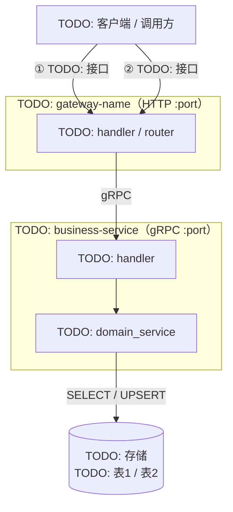
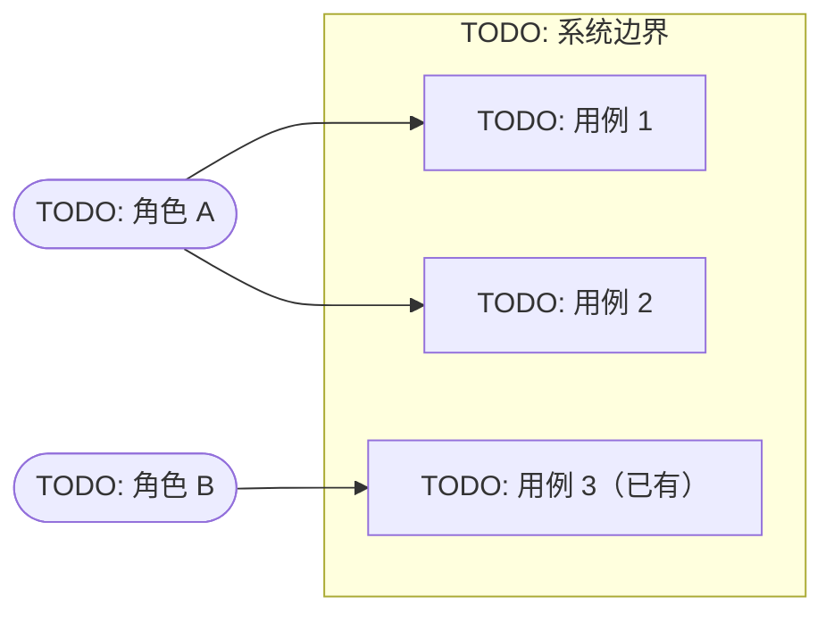
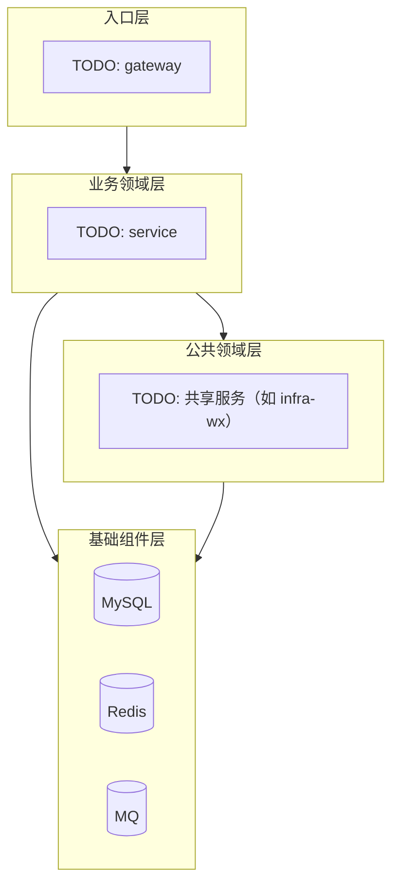
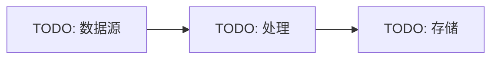
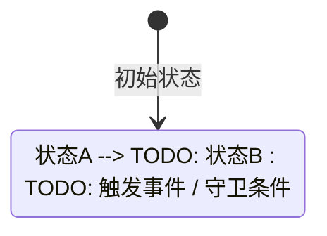

# Technical Design: <change title>

> 详细填写指引见 dq-be-tech-design skill。
> 每个章节标题**必须保留**；触发则实写内容，不触发则正文写 `无改动` + 一行原因。
> **23 节是基线骨架，不是上限**：change 性质特殊时可追加 §24 / §25 或在既有章节内加子节（骨架不删、按需扩展）。
> 图形内容（流程图、时序图、架构图）**优先使用 mermaid 格式**。

## 1. 目标

<1-3 段 what + why，技术视角，与 proposal 呼应>

## 2. 需要pm或者其它相关方决策和讨论的点

<可选。列出需要产品、运营、设计、法务、数据、上下游 owner 等相关方拍板或讨论的问题>

## 3. 整体架构

### 服务调用链路图（必须）

> 规范：**每个服务/仓库的内部组件用一个 subgraph 框起来**，subgraph 标题写服务名（可带端口 / 协议）；外层按逻辑边界分组（调用方 / 网关 / 业务服务 / 存储 / 外部依赖）。



**调用时序：**

| # | 调用路径 | 协议 / 路径 | 动作 |
|---|---|---|---|
| ① | TODO → TODO | `POST /TODO` | TODO |
| ② | TODO → TODO | `POST /TODO` | TODO |

<!-- 按需补充（删除不用的注释块）

### 用例图（有多角色 / 新增用户可见能力时）


### 系统分层架构图（新服务 / 跨多服务时）

> 规范：**粒度到服务/仓库为止**（每个节点是一个服务或一个仓库，**不展开服务内部组件**——内部代码结构见 §12）。



### 数据流向图（消息驱动 / 多写 / ETL 场景）

-->

**服务清单：**

| 服务 | 职责 |
|---|---|
| TODO | TODO |

## 4. 服务职责边界

<触发：多服务 / 新服务。格式：表格 `组件 | 职责 | 不做什么`。不触发：写"无改动" + 原因>

## 5. 领域实体关系（DDD）

<触发：新聚合 / 新实体 / 改聚合边界。格式：mermaid classDiagram 或文字描述实体 / 值对象 / 聚合根 / 关系。
领域建模视角（vs §7 持久化视角）。不触发：写"无改动" + 原因>

## 6. 领域服务能力（DDD）

<触发：新增或修改 domain_service 方法。每项含：能力名 / 输入 / 输出 / 前置条件 / 业务不变量。
必须用领域能力语义（如"用户注册"/"订单结算"），不是 curd。领域能力视角（vs §8 接入层接口）。
不触发：写"无改动" + 原因>

## 7. 库表设计

<触发：库表变更。所有涉及的表（新建/修改/跨域只读）均列完整 CREATE TABLE 语句。

**新建表**：完整 CREATE TABLE + 派生状态说明。

**修改表**：完整 CREATE TABLE（注释标注变更字段）+ 影响评估（数据迁移见 §16）。

**跨领域/服务的表**（临时直读）：完整 CREATE TABLE + 标注 `[跨域临时]` + owner 服务 + 本 change 消费字段；理论上应通过对应服务接口访问，当前考虑成本暂时直接读，后续纳入技术债偿还。

不触发：写"无改动" + 原因>

## 8. Proto 契约

<触发：idl 变更。不触发：写"无改动" + 原因。

> idl 统一在 `gitlab.daqian369.com/esm/narnia/idl` 仓库管理；业务服务只 import，不放 proto 源文件。详见 dq-be-idl-convention skill。

IDL 路径：`gitlab.daqian369.com/esm/narnia/idl`
`option go_package = "gitlab.daqian369.com/esm/narnia/idl/gen/go/TODO"`

文件清单：
- `TODO/foo.proto`（新建）— TODO: 变更点
- `TODO/bar.proto`（修改）— TODO: 变更点

### 7.1 TODO: foo.proto（新建）

```protobuf
syntax = "proto3";
package TODO;
import "idl/base.proto";

message TODORequest {
  TODO field = 1;
  base.BaseReq base_req = 255;
}
message TODOResponse {
  TODO field    = 1;
  base.BaseResp base_resp = 255;
}
```

### 7.N TODO: service 注册（HTTP 路径绑定）

```protobuf
service TODOService {
  rpc TODO (TODORequest) returns (TODOResponse) {
    option (google.api.http) = { post: "/api/TODO" body: "*" };
  }
}
```
>

## 9. 状态机

<触发：引入/修改状态机。mermaid stateDiagram-v2；列出状态、转换、触发事件、守卫条件。不触发：写"无改动" + 原因>



**状态说明：**

| 状态 | 含义 | 守卫条件 |
|---|---|---|
| TODO | TODO | TODO |

## 10. 核心流程

<触发：新流程 / 流程变更。mermaid 序列图 / 伪代码。不触发：写"无改动" + 原因>

## 11. 服务启动

<触发：新服务 / 启动顺序变更。main 初始化顺序 / 依赖关系。不触发：写"无改动" + 原因>

## 12. 服务目录结构（服务内部代码架构）

<触发：新服务 / 结构大调。对照 dq-be-code-structure 规范。不触发：写"无改动" + 原因>

## 13. 错误码规范

<触发：新增业务错误码。表格 `code | HTTP | 语义`。不触发：写"无改动" + 原因>

## 14. 日志规范

<触发：新增关键事件日志。event 名 / 字段列表 / 示例。日志工具使用规范见 dq-be-libs §2.3。不触发：写"无改动" + 原因>

## 15. 监控 / 告警

<触发：新增指标 / 告警点。指标名 / 维度 / 告警阈值。不触发：写"无改动" + 原因>

## 16. 数据迁移

<触发：存量数据处理。迁移脚本 / 双写策略 / 校验方案。不触发：写"无改动" + 原因>

## 17. 兼容性 / 灰度 / 回滚

<触发：有线上兼容考量。向前/后兼容策略 / 灰度步骤 / 回滚脚本。不触发：写"无改动" + 原因>

## 18. 部署

<触发：新服务 / 新增依赖资源 / 已有资源容量变更 / 明确依赖的环境变量。说明 K8s Deployment / 副本数 / 资源预估 / 依赖集群 / 环境变量；明确新增依赖资源是否需要部署、已有依赖资源是否需要扩缩容、依赖的环境变量是否已配置。不触发：写"无改动" + 原因>

## 19. 风险 & 兜底

<即使无重大风险也要写"主要风险评估"一段。格式：表格 `风险 | 应对`>

## 20. 不在本设计范围

<显式圈边界，避免 scope creep>

## 21. 参考 / 相关文档

<可选。PRD / 上下游 tech_design / 外部资料链接>

## 22. todo事项

<可选。设计阶段未定的点，后续 change 或 TODO 跟进>

## 23. 变更点核心记录

<每次人工 review 前更新。**核心变动摘要由 AI 自动梳理**（读 §23 上次登记以来的 tech_design.md diff + git log），作者无需手写。

触发时机：
- **方案变更记录**：作者一句话触发（如"登记变更" / "在 tech_design 里记录一个变更点"），AI 读 diff 追加；纯代码 bug 修复不记>

| # | 变更点名 | 时间 | commit_id | 变动摘要 | reviewer |
|---|---|---|---|---|---|
| 1 | TODO | YYYY-MM-DD | <hash1> | （AI 根据 tech_design diff 自动填） | @xxx |
| 2 | TODO | YYYY-MM-DD | <hash2> | （按需） | @xxx |
