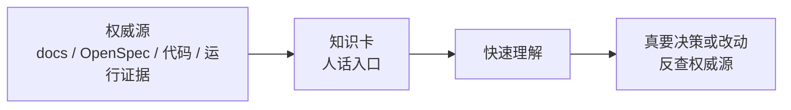
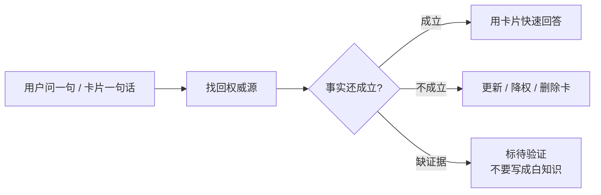

> **公理继承 / Axiom Inheritance**
> 本 skill 服从顶层公理 `typed evidence gates action`——
> 未经类型化（三色 + authority + kind）的上下文不允许驱动行动。
> 在该公理下，本 skill 的职能：把困惑/决策点编译成带证据 + 失效条件的可复用类型化卡片

# Knowledge Card QA

目标不是记录问答历史，而是把一个容易误解的业务动作压缩成可复用知识卡。卡片应该让用户能快速回答：“我做了什么，系统自动做什么，写到哪里，哪些旧说法要丢掉。”

## 卡片定位

知识卡不是新权威文档，也不是任务表。它只是“下次 10 秒钟想起来”的人话入口。



默认不要让用户维护卡片系统。agent 负责判断是否落卡、写卡、反查源、发现过期后更新或降权。用户只需要说“这个落卡”“别落，太细了”或“这张卡不对，重捋”。

## 与 Context Compiler 的关系

本 skill 是人话入口层，不是知识真源，也不是默认决策锁。

核心规则：

- 原始上下文必须先能反查权威源，不能把聊天里的漂亮总结直接落成白知识。
- 如果输入来自 PRD、设计稿、LLM 总结、术语漂移或 claim 分歧，先用 `canonical-claim-compiler` 判断 concept / claim / pending / drift。卡片只能复述这些状态，不能自己发明 canonical identity。
- 决策场景下，卡片用于把候选、证据、风险和不做事项摆给用户拍板；agent 不替用户 lock。
- 非决策场景下，卡片用于降低下次理解成本；默认实时解释，不默认存储。
- 存储卡片前必须确认它是高频、高风险、容易误解，并且有可逆的证据链。

卡片输出前要过三类轻量校准：

| 检查 | 卡片里的落点 |
|---|---|
| `logical-grammar` | 动作链里的对象、动作、状态必须能反查；混合概念先拆开 |
| `truth-condition-checker` | 决策卡的默认建议必须写真值条件、反例和失效条件 |
| `say-show-boundary` | 事实依据、价值偏好、审美倾向分开写；价值判断不能写成白知识 |

## 使用时机

- 用户要理解项目、OpenSpec change、任务计划、代码链路或业务机制。
- 用户给出一段长对话 / timeline，希望提炼成快问快答。
- 用户要求“说人话”“符合我的语言标准”“不要只列字段名”。
- 用户问“这个理解对不对”“哪些要改、哪些是对的”。
- 用户问“是否要落卡”“卡片怎么维护”“要不要存储还是实时捞取”。

## 路由

| 场景 | 动作 |
|---|---|
| 输入材料很长、需要裁决对错 | 先用 `problem-review-mapper` 抓动词、排顺序、连箭头 |
| 输入材料是 PRD / 设计稿 / LLM 总结，或涉及术语不统一 | 先用 `canonical-claim-compiler` 输出 accepted / pending concept 和 claim |
| 需要查业务域现有知识 | 按需用 `project-wiki` / `project-knowledge-curator` 找权威页和三色知识 |
| 涉及 OpenSpec / 技术设计裁决 | 用 `dq-be-core:dq-be-tech-design`（plugin）、项目 `openspec/AGENTS.md` 或项目指定的 tech design 规则裁决 |
| 涉及测试、日志、运行证据 | 派 subagent 取证，主 agent 只回收并裁决 |

## 决策卡模式

当用户是在做决策，而不是只要解释时，先输出临时决策卡，不要直接替用户选。

临时决策卡应包含：

| 字段 | 写什么 |
|---|---|
| 场景 | 这次决策解决什么协作/产品/技术动作 |
| 候选 | 2-4 个互斥方案；没有互斥就先补拆 |
| 默认建议 | agent 可给推荐，但必须说明证据和风险 |
| 不选什么 | 明确会退出的旧说法、旧链路或误解 |
| 证据 | docs / OpenSpec / 代码 / 日志 / 用户确认；Obsidian 知识优先给 `[[功能点]] + claim_ref`；事实依据和价值偏好分区 |
| 失效条件 | 哪些事实变化后必须重验 |

用户拍板后，才把被选项收敛成普通知识卡或写回对应权威源。

如果候选涉及 canonical identity，临时决策卡还必须写：

| 字段 | 写什么 |
|---|---|
| identity 状态 | `accepted / pending / disputed / superseded` |
| claim_ref | `claim_id + local_truth_hash + closure_truth_hash`，没有就写 pending |
| drift 类型 | lexical / concept identity / proposition / source / status / implementation |

## Loop 收口卡模式

当用户在推进长任务、roadmap、OpenSpec、`/goal`、ralph-loop 或多 agent 执行时，每个短任务结束后先做一次内部快问快答自检。它默认不落库，只用于决定是否需要回写 roadmap / wiki / OpenSpec。

```md
**问：本轮到底闭合了什么？**
答：<一句话说明本轮从什么状态推进到了什么状态。>

现状：<代码/文档/路书现在真实是什么状态。>
改动：<本轮新增、删除、修正了什么；包括明确抛弃的旧说法。>
证据：<路径 / 测试 / 日志 / 用户裁决 / Knowledge Pack；Obsidian 知识写 [[功能点]] + claim_id/source_ref。>
路书状态：<灰 / 黄 / 红 / 绿；如有新增任务链或子环，说明是否已写入 .canvas。>
知识状态：<无新知识 / 已写回 / 待 Curator / 旧知识已退出 / 缺证据。>
下一步：<只写一个最小下一动作；没有就写完成。>
```

判断规则：

| 结论 | 动作 |
|---|---|
| 本轮只是一次性进度 | 不落卡；但必须同步 roadmap 状态 |
| 发现高频误解或旧知识污染 | 写知识卡，标 `不做 / 丢弃` 和失效条件 |
| 引入新业务事实或验收口径 | 先交给 project-wiki / Curator，不直接写成白知识卡 |
| roadmap 新增任务链 / 子环 | 先回写 `.canvas`，快问快答只做收口说明 |
| 用户需要拍板 | 输出临时决策卡，不替用户 lock |

## 抽卡流程


## 是否落卡

只用一个主判断：

> 这个问题以后还会不会反复误解，且误解会不会导致做错事？

会，就落卡。不会，就只在聊天里解释。

| 场景 | 动作 |
|---|---|
| 用户问过 2 次以上，或 agent 曾答错过 | 落卡 |
| 会影响代码方向、OpenSpec、表/RPC、任务拆分 | 落卡 |
| 跨多个文档，不做卡下次还要重新捋 | 落卡 |
| 只是一次性进度、Todo、临时会议流水账 | 不落卡 |
| 权威文档里已经一句话讲清楚 | 不落卡 |
| 还没裁决清楚，只是讨论中 | 不落卡；最多临时卡 |

落卡是例外，不是默认动作。卡片用于“下次还会错、错了会伤”的地方。

## 卡片格式

每张卡只回答一个高频困惑。默认用这个结构：

```md
### 卡片名：<业务动作 / 困惑点>

一句话：
<用用户能接受的语言说清场景结论。>

关键词：
`功能关键词` -> <对应动作>

动作链：
1. <用户动作>
2. <系统动作>
3. <写入 / 读取 / 同步对象>
4. <后续展示或影响>

不做 / 丢弃：
- <明确不会发生的动作>
- <旧知识、错字段、错链路、错状态>

状态：
<已落地 / 目标态 / 部分落地 / 待验证。灰知识必须说灰。若关联 canonical claim，写 semantic_status / delivery_status / implementation_lifecycle。>

Claim：
<没有 canonical claim 就写“无”。有则写 claim_id、local_truth_hash、closure_truth_hash、accepted/pending/disputed/superseded、drift 状态。>

逻辑校准：
- 语法：<对象 / 动作 / 状态是否成句；不成句则不落卡>
- 真值：<什么条件下这张卡成立；什么会反驳>
- 边界：<哪些是事实，哪些只是价值/审美/愿景取向>

证据：
<文档、代码、日志、OpenSpec、用户确认。Obsidian 知识优先写业务域、#业务标签、[[功能点]]、claim_id / claim_ref 和 [[页面#^block-id]]；只有路径不够。>

失效条件：
<哪些文件、契约、任务状态或运行证据变化后，这张卡必须重验。>
```

## 语言标准

好的卡片：

- 先讲场景，再讲表、RPC、字段。
- 用“我做 X，系统做 Y，后续 Z”的动作语言。
- 暴露少量凝练功能关键词，并把关键词绑定到动作。
- 明确当前事实、目标态、旧链路退出方式。
- 说清“不做什么”，避免错知识继续污染上下文。
- 证据等级要明显：白知识可直接答，灰知识标部分/待验证，黑知识进“丢弃”。
- 能反向指回权威源；Obsidian 知识必须能从 `[[功能点]]` 点回 claim_ref，指不回去的卡不能存成白知识。
- 有 canonical claim 时必须显示 claim 状态；不要把 pending / disputed 写成已确认。

不要这样写：

- 不要把 Q1/Q2/Q3 timeline 当卡片；那是会话流水账。
- 不要只列字段名、表名、Todo；用户无法据此判断场景。
- 不要把“我曾经答错了”混进最终卡片；只保留修正后的真相和被丢弃的旧说法。
- 不要把目标态说成已落地。
- 不要把未 accepted 的 pending claim 写成“已知事实”。
- 不要为了完整而堆十几个问题；一张卡只解决一个困惑。

## 快速裁决表

当输入里混有对错说法，先收敛成四类，再写卡：

| 类别 | 处理 |
|---|---|
| 对的 | 进入卡片“一句话 / 动作链” |
| 不对的 | 进入“不做 / 丢弃” |
| 缺证据 | 进入“状态：待验证”，不写成事实 |
| 旧知识 | 标 legacy / superseded，给替代真源 |
| 价值/审美 | 不写成事实；进入“取向 / 约束 / 例子 / 可观察后果” |

## 存储与维护

采用混合策略：

- 默认实时捞取，不落卡。
- 高频、高风险、已裁决的困惑才存成卡。
- 卡片只做理解入口，不能替代 docs / OpenSpec / 代码 / 运行证据。
- 每张存储卡必须有证据和失效条件。
- 后续相关任务中，如果权威源变化，agent 负责更新、降权或删除卡。

推荐存储位置：

| 卡片类型 | 位置 |
|---|---|
| 当前对话临时卡 | 不存 |
| OpenSpec change 内的任务理解卡 | `openspec/changes/<change>/knowledge_cards.md` |
| 业务域高频理解卡 | `docs/<业务域>/knowledge/cards.md` 或项目约定的知识目录 |
| skill 本身 | 只放制卡方法，不放项目事实 |

## 反向校验

卡片必须支持从“人话结论”反查回权威源：



如果卡片无法反查表、RPC、代码、文档、日志或用户确认，就只能作为临时解释，不能落成稳定卡。

## 最小输出

用户只要一个快答时，输出可以压到 5 行：

```md
**问：<问题>**
答：<一句话场景结论>。
关键词：`A` -> <动作>，`B` -> <动作>。
不做：<最容易误解的一件事>。
证据：<最短来源>。
```
