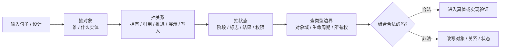

# Logical Grammar

本 skill 只判断“这句话能不能成句”，不判断“这句话真不真”。

它用于在行动前检查对象、关系、状态、动作的组合是否合法，避免把不属于同一类型层级的东西硬连在一起。合法组合通过后，真假交给证据、日志、代码或 `truth-condition-checker`。

## 输入前置检查

router 已经做了一道分流，但 router 可能判错或被绕过。本 skill 在开工前必须自检一次——这是冗余兜底，不是 router 的替代：

- 输入里出现 `高级 / 自然 / 有趣 / 克制 / 正确方向 / 更好 / 更合理 / 应该` 等价值/审美/愿景词时，**停下来转 `say-show-boundary` 剥层**，剥完只剩事实层再回来跑语法。
- 输入来自 PRD / 设计稿 / LLM 总结，且问题是“这个词是不是已有对象”“这两句话是不是同一 claim”时，**先转 `canonical-claim-compiler`**。本 skill 不裁决 identity。
- 输入是开放式问题（"我们应该怎么 X"）而非具体对象关系判断时，**转 `problem-statement-card`**。
- 输入是已成句的 claim / gate / decision 真值问题而非对象组合问题时，**转 `truth-condition-checker`**。

本 skill 只在确认输入是"对象/关系/状态/动作组合问题"后才继续。

## 核心分工

| 问题 | 本 skill 管吗 |
|---|---|
| `A` 能不能拥有 `B` 这个状态 | 管 |
| `A` 能不能执行 `B` 这个动作 | 管 |
| `A` 和 `B` 是否属于同一层级/同一对象域 | 管 |
| `A` 和 `B` 是否是同一个 canonical concept | 不管，交 `canonical-claim-compiler` / Curator |
| 两条话是不是同一个 `claim_id` | 不管，交 `canonical-claim-compiler` / Curator |
| `A` 是否真的处于 `B` 状态 | 不管 |
| 某个 claim 是否被日志证实 | 不管 |
| 某个方案值不值得做 | 不管 |

一句话：**先验语法，不是真值验证。**

## 判断流程



## 四类语法检查

| 检查 | 问法 | 常见错误 |
|---|---|---|
| 对象合法性 | 这个对象存在吗，粒度对吗 | 把页面状态当服务端事实 |
| 关系合法性 | 这个关系能连这两个对象吗 | 把展示关系写成所有权关系 |
| 状态归属 | 这个状态属于谁，生命周期到哪里 | 把一次请求状态挂成房间永久状态 |
| 动作能力 | 这个主体能执行这个动作吗 | 让配置“决定”运行时事实 |

## 输出格式

```md
结论：合法 / 不合法 / 需要拆句

语法骨架：
- 对象：
- 关系：
- 状态：
- 主体动作：

判断：
- 合法组合：
- 非法组合：
- 需要改写：

下一步：
- 若语法合法：交给 truth-condition-checker / 代码证据 / 日志验证。
- 若语法非法：先修正对象、关系或状态归属，再谈真假。
```

## 改写规则

- 把“事实判断”先改成“对象-关系-状态”结构。
- 把混合句拆成多句；每句只保留一个主对象和一个主要关系。
- 如果一个字段同时承载事实、愿景、UI 展示和权限，先拆语义，不要继续堆字段。
- 如果一个关系只是展示、投影、缓存、推断，就不要写成持久所有权。
- 如果一个对象只在前端、配置、日志或临时请求里存在，不要默认它是业务实体。
- 如果对象身份还没有 accepted `concept_id`，只能输出语法候选；不能把它写成 locked fact 或 roadmap 锚点。

## 禁止动作

- 不要用“语法合法”替代“已经证实”。
- 不要因为用户表达听起来合理，就跳过对象域和生命周期检查。
- 不要把价值词当状态词，例如“高级”“好玩”“正确方向”；这类词交给 `say-show-boundary`。
- 不要用兜底字段绕过语法问题；先问为什么原来的对象关系放不下。
- 不要把“语法上能成句”当成“已有 canonical identity 已确认”。
