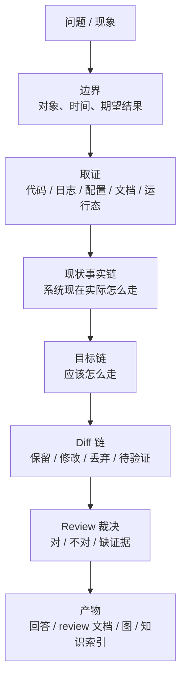
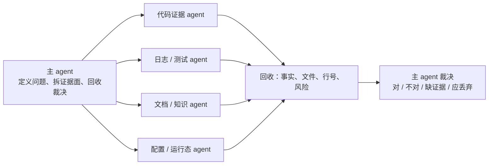
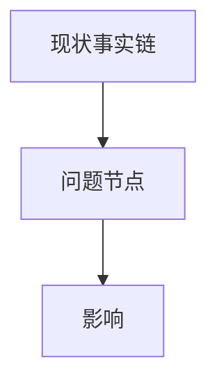
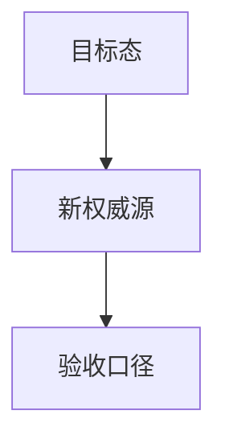
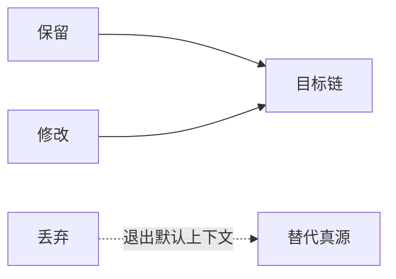

# Problem Review Mapper

复杂问题先画事实链、目标链和 diff 链；再调用必要的知识治理 skill；最后输出裁决，而不是只给解释。

## 核心原则

- 图先于长文字。复杂问题先给 Mermaid 图，再给结论和证据。
- 先证据，后裁决。没有证据的判断只能标为待验证，不能写成确定结论。
- 先现状、目标、diff，再 Todo。改东西必须同时说清楚现状、为什么改、改后目标、旧东西如何退出。
- 图要带裁决语义，不只是复述流程。关键节点标注：已证实、推断、冲突、待验证、应丢弃。
- 主 agent 做编排和决策；测试、查日志、独立取证时派 subagent。

## 默认输出形状

回答时优先使用这个顺序：

1. 结论：先给一句话 verdict。
2. 图：给现状图、目标图或 diff 图，按问题复杂度选择一个或多个。
3. 裁决：列出对的、不对的、缺证据的、应丢弃的。
4. 证据：只放支持裁决的关键文件、日志、配置或文档。
5. 产物：说明写了什么文档、改了什么索引、下一步如何验证。

## Skill 路由

本 skill 是编排层，不复制知识库治理逻辑。按需调用其他 skill：

| 场景 | 动作 | 调用 |
|---|---|---|
| 用户只要解释思路或排查框架 | 直接画问题链路并给 review | 不调用 |
| 用户问“为什么会改这个” | 画因果链，查证据强弱 | 可调用 project-knowledge-curator |
| 用户问“本地有没有这个知识” | 做知识命中检测 | 调用 project-wiki + project-knowledge-curator |
| 用户要求“哪些对，哪些不对” | 做裁决表，标证据等级 | 可调用 project-knowledge-curator |
| 用户要求整理成文档和图 | 写 review 文档，维护索引 | 调用 project-wiki / curator writeback |
| 发现错知识、旧知识污染上下文 | 执行降权、归档、替代真源 | 调用 project-knowledge-curator Repair Loop |

调用 project-wiki 时，只用它做业务域、功能点、README、Knowledge Pack、Obsidian 索引的查询和回写。

调用 project-knowledge-curator 时，只用它做 `knowledge-hit-detect`、三色知识、authority 分级、Conflict Verdict、Repair Loop 和索引健康检查。

## 多 agent 扇出模板

当问题需要并行取证时，主 agent 先画取证拓扑，再派 subagent：

派发时每个 subagent 必须有明确边界：

- 查什么证据面。
- 不查什么，避免重复。
- 输出必须包含路径、行号、日志窗口或文档来源。
- 不要让 worker 私自把灰知识写成白知识。

## Review 裁决格式

默认用四栏收敛：

| 类别 | 含义 | 输出要求 |
|---|---|---|
| 对的 | 已被代码、日志、配置或权威文档支持 | 写入结论，可作为下一步依据 |
| 不对的 | 与现状冲突、链路不通或误读了权威源 | 明确指出为什么不成立 |
| 缺证据 | 目前只有推断或单点证据 | 标待验证，不进入 locked facts |
| 应丢弃 | 旧链路、旧知识、错误前提或会污染上下文的方案 | 指明替代真源或退出方式 |

## 文档沉淀

当用户要求落文档，或本轮形成 durable knowledge 时：

- 优先写到对应业务域的 `knowledge/` 目录。
- 文件名已经承担标题时，正文不要重复同名 `# H1`。
- 文档必须包含 Mermaid 图。
- 写回 `knowledge/README.md` 索引；若是灰知识，明确标 `knowledge_color: gray`。
- 若发现旧知识不应继续进入默认上下文，调用 curator 的 Repair Loop，而不是只在聊天里说一句。

## Mermaid 图规则

图必须服务裁决，不画装饰图。

推荐节点标签：

- `已证实`
- `推断`
- `冲突`
- `待验证`
- `应丢弃`
- `目标态`

推荐三类图：

## 不要做的事

- 不要用长段文字替代图。
- 不要把“可能”写成“已经确定”。
- 不要只列 Todo，不解释现状和要抛弃什么。
- 不要复制 project-wiki 或 project-knowledge-curator 的完整规则；需要时调用它们。
- 不要把单次聊天原文当作知识沉淀；应收敛成白 / 灰 / 黑知识。
