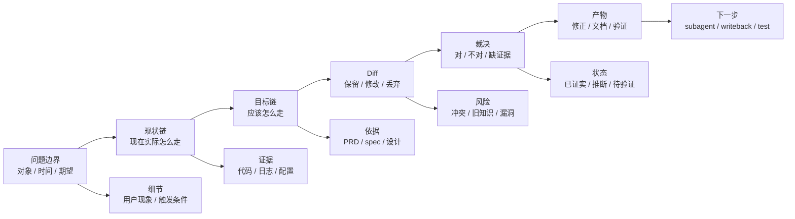
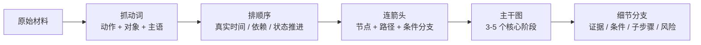
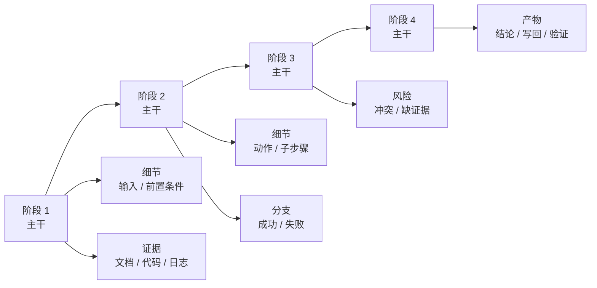
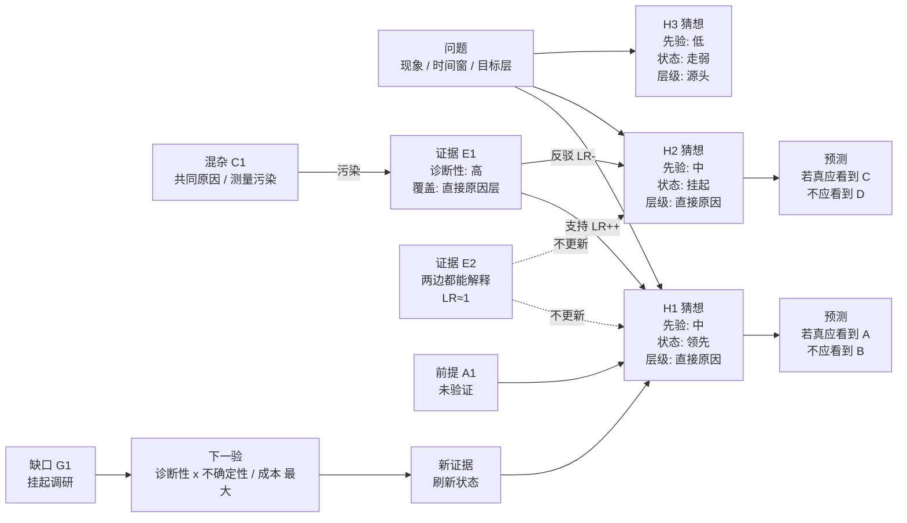
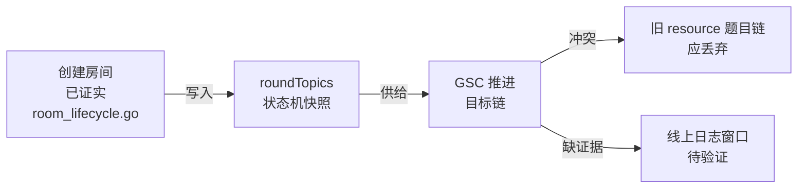
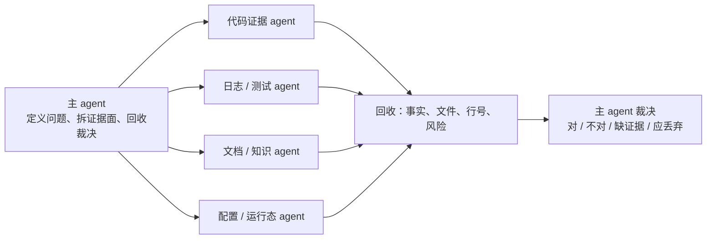
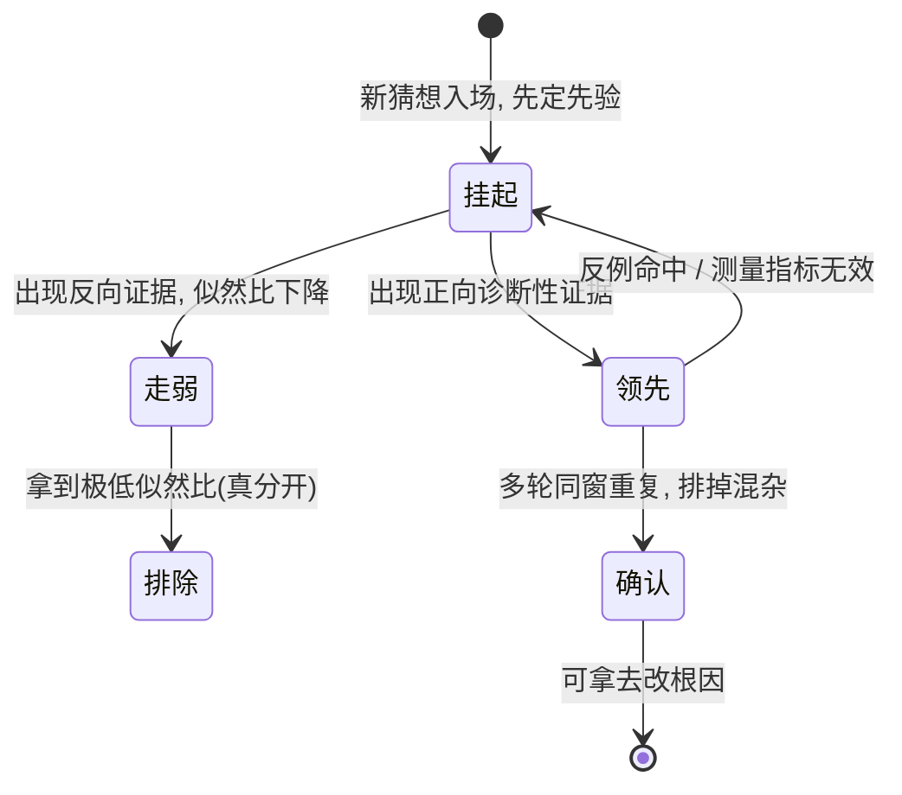
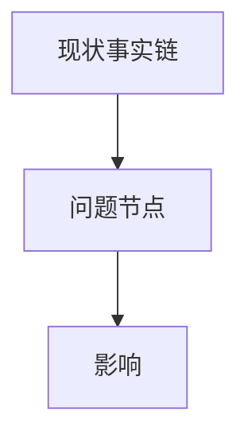
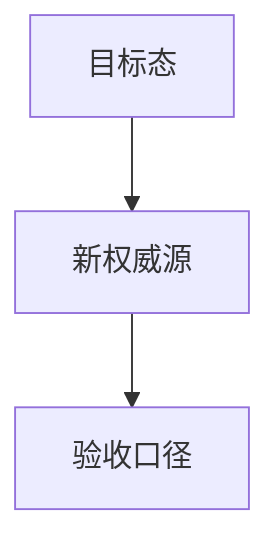
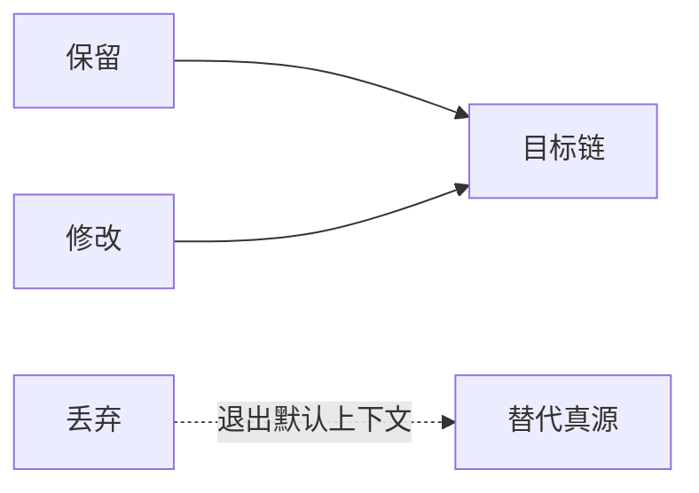

> **公理继承 / Axiom Inheritance**
> 本 skill 服从顶层公理 `typed evidence gates action`——
> 未经类型化（三色 + authority + kind）的上下文不允许驱动行动。
> 在该公理下，本 skill 的职能：用图先于文字的方式做证据收敛和裁决，多 agent 扇出取证

# Problem Review Mapper

这个 skill 的核心不是“三段式回答”，而是把复杂排查、review 和知识校准压缩进一张能读的图里。

图要承担主信息：主干、顺序、细节、证据、分支和裁决都尽量放进图。文字只补一句结论、必要证据和落盘说明。

## 核心原则

- 图先于长文字。复杂问题先给 Mermaid 图，文字只解释图里看不出来的少量信息。
- 先证据，后裁决。没有证据的判断只能标为待验证，不能写成确定结论。
- 先现状、目标、diff，再 Todo。改东西必须同时说清楚现状、为什么改、改后目标、旧东西如何退出。
- 先抓动作，再排顺序，最后连箭头。复杂材料先抽取动作和对象，再组织成空间路径。
- 先定主干，再挂细节。主干保留 3-5 个核心阶段；细节挂到对应阶段，避免塞满主流程。
- 图要带裁决语义，不只是复述流程。关键节点标注：已证实、推断、冲突、待验证、应丢弃。
- 图里要尽量包含核心信息：动作、对象、顺序、条件、证据来源、风险、产物和下一步。
- 主 agent 做编排和决策；测试、查日志、独立取证时派 subagent。

## 与 Context Compiler 的关系

本 skill 是裁决压缩层。它的产物不是漂亮图，而是把未类型化材料压成可裁决结构：


如果材料牵涉业务域知识，图只能承载裁决过程；白/灰/黑、authority、Repair Loop 仍由 `project-knowledge-curator` 裁定。

如果材料来自 PRD、设计稿、LLM 总结，或争议点是“是否同一个对象 / 是否同一条 claim / 是否发生 drift”，先用 `canonical-claim-compiler` 产出 `concept_id / claim_id / pending / drift_report`。本 skill 负责把证据链画清楚，不负责给 identity 立法。

## 三类逻辑校准

本 skill 负责把三类逻辑校准压进图和裁决表，但不替代下游真源：

| 检查 | 在图里的落点 |
|---|---|
| `logical-grammar` | 每个节点先落成对象 + 动作/关系 + 状态；对象域或状态归属不清时标 `语法待改写`，不要继续裁决真假 |
| `truth-condition-checker` | 每个结论必须能拆出成立条件、反例/失败方式和当前证据；缺条件就标 `缺证据` |
| `say-show-boundary` | 事实节点、价值/审美/愿景节点必须分开；后者只能作为取向、约束或例子，不能当白知识证据 |

用户或 agent 前提不成立时，用纠正句式：

```text
这里要纠正一下：<旧说法> 不成立。
当前证据支持的是 <新说法>。
后续按 <纠正动作> 走，<旧动作/旧说法> 不再作为默认上下文。
```

## 图优先输出

默认把回答压缩成一张“review 编排图”。主干表达顺序，两侧分支承载细节：



文字回答只保留三类内容：

- 一句话结论：图表达不了的最终 verdict。
- 关键证据：文件、行号、日志窗口或文档来源。
- 落盘说明：写了什么、索引到哪里、还缺什么验证。

## 从材料到图

当输入是一大段文字、PRD、日志、设计稿、代码 diff 或会议材料时，先做最小抽取：



抽取规则：

- 抓动词：去掉解释性和修饰性文字，只保留关键动作、动作对象和必要主语。
- 过 identity：涉及 PRD / OpenSpec / Obsidian 同步时，先标出已有 `concept_id / claim_id`；没有 id 的节点只能标 pending，不能画成已确认事实。
- 过语法：每个节点必须能说清对象、关系/动作、状态；说不清先拆句或改写，不要把混合概念画成主干。
- 排顺序：按真实事件、操作约束、状态流转或因果依赖排序，不能凭直觉重排。
- 连箭头：用箭头表达路径；遇到 `如果`、`是否`、`成功/失败` 时加判断节点。
- 定主干：把流程压缩成 3-5 个核心阶段；超过 7 个时先合并。
- 挂细节：每个细节必须归属于一个主干节点；归属不清的先放到 `待归类 / 待验证`。

## 流程放射图

当材料细节很多、但仍有顺序时，优先画流程放射图：中间是主干顺序，两侧挂细节。



两种画法：

- 流程明确时：先定骨架，再填细节。
- 材料混乱时：先发散列出事实、动作和疑点，再收敛成 3-5 个主干节点。

检查问题：

- 主干是否能独立讲清整体流程？
- 细节是否都挂在正确阶段下？
- 是否有阶段过重，需要拆分？
- 是否仍然一眼能看到整体顺序？

## 图型选择

不要把所有问题都画成流程图。先判断图要回答什么：

| 问题类型 | 默认图型 | 负责回答 |
|---|---|---|
| 原因不明、多个猜想竞争、需要刷新判断 | 证据态势图 | 哪个猜想领先 / 走弱 / 挂起，下一条最值钱的证据是什么 |
| 材料很多但有时间或依赖顺序 | 流程放射图 | 主干怎么走，细节挂在哪个阶段 |
| 单条 claim / gate / decision 是否成立 | 真值依赖图（转 `truth-condition-checker`） | 成立条件、反例、最小杀链集是什么 |
| PRD / 术语 / 断言身份不清 | claim 身份图（先转 `canonical-claim-compiler`） | 是不是同一个 concept / claim，是否发生 drift |
| 长任务执行、挂起调研要闭环推进 | roadmap runtime group（转 `project-roadmap-board`） | 哪个工作块黄/红/绿，证据和未决点怎么推进 |

口诀：

```text
判断态势用证据态势图；
讲顺序用流程放射图；
审结论用真值依赖图；
定身份先 claimize；
长期推进上 roadmap。
```

## 证据态势图

当问题的核心是“多个猜想里哪个更像真因 / 哪条证据能拉开差距 / 哪些调研还挂起”时，默认画证据态势图。它吸收四类成熟模型，但只保留工程排查需要的部分：

- ACH 矩阵：每条证据横向扫所有猜想，判断支持、反驳还是不更新。
- Argument Map：把猜想、证据、前提、缺口和下一验画成节点。
- Causal DAG：把混杂变量画出来，防止把代理相关当真因。
- Evidence Gap Map：把挂起调研单独保留，不让 pending 伪装成 fact。

证据态势图不追求精确概率；它追求可更新、可证伪、可继续推进。



节点类型：

| 类型 | 必填字段 | 禁止写法 |
|---|---|---|
| `Q` 问题 | 现象、时间窗、目标层 | “系统坏了”这种无边界问题 |
| `H` 猜想 | 因果命题、先验、状态、层级 | 只写“网络问题”“VLM 问题”这种粗包 |
| `P` 预测 | 若真应看到、若假也可能看到 | 只写支持证据，不写失败信号 |
| `E` 证据 | 来源、诊断性、覆盖层、可信度 | 把 fixture / validate / 文件存在当目标证据 |
| `C` 混杂 | 共同原因、测量污染、控制办法 | 只说“可能有干扰”但不写污染哪条证据 |
| `A` 前提 | 未验证前提、当前强度、失效方式 | 把前提藏在叙述里 |
| `G` 缺口 | 缺什么、影响哪个状态、谁来验 | 把挂起调研写成已知事实 |
| `N` 下一验 | 能分开哪些猜想、成本、预期更新 | 验最顺手但不能更新判断的动作 |

边语义：

| 边 | 含义 |
|---|---|
| `支持 LR++ / LR+` | 该证据在这个猜想为真时更常见，可上调 |
| `反驳 LR- / LR--` | 该证据在这个猜想为真时很少见，可下调或排除 |
| `LR≈1 不更新` | 两边都会这样，不能改变判断 |
| `污染` | 混杂变量会让证据失去诊断性 |
| `覆盖` | 证据只打到某一层，不能整包排除 |
| `待验` | 缺口尚未闭合，不能进入 locked facts |

最小数据模型：

```yaml
question:
  id: q1
  text: "<要解释的现象>"
  scope: "<环境 / 时间窗 / 用户路径>"
  target_layer: "why_broken | direct_cause | source | root_cause"

hypotheses:
  - id: h1
    claim: "<因果命题>"
    prior: "low | medium | high"
    prior_source: "<历史事故 / 改动面 / 日志 / 架构约束>"
    status: "排除 | 走弱 | 挂起 | 领先 | 确认"
    layer: "why_broken | direct_cause | source | root_cause"
    predicts:
      should_see: ["<若真应看到>"]
      should_not_see: ["<若真不应看到>"]
      also_possible_when_false: ["<若假也可能看到>"]
    boundary: "<这条猜想只解释什么>"

evidence:
  - id: e1
    observation: "<观测事实>"
    source: "<日志 / 代码 / 数据 / 文档 / 用户裁决>"
    credibility: "low | medium | high"
    diagnosticity: "low | medium | high"
    covers_layer: "<证据覆盖到哪层>"
    updates:
      - hypothesis: h1
        relation: "supports | contradicts | no_update"
        lr_bucket: "-- | - | 0 | + | ++"
      - hypothesis: h2
        relation: "supports | contradicts | no_update"
        lr_bucket: "-- | - | 0 | + | ++"

confounders:
  - id: c1
    text: "<共同原因 / 测量污染>"
    affects: ["e1"]
    control: "<怎么控制变量>"

gaps:
  - id: g1
    question: "<缺什么证据>"
    blocks: ["h1:确认", "h2:排除"]
    next_probe: "<最低成本高诊断性验证>"
    expected_split: ["h1", "h2"]
    owner: "<agent / human / tool>"
```

输出要求：

- 至少列 2 个竞争猜想；只有 1 个猜想时先问“还有什么可能”。
- 至少有 1 条证据横扫多个猜想；否则只是单点佐证，不是排查。
- 所有 `排除` 必须写 `covers_layer`，否则降级为 `走弱`。
- 所有 `领先` 必须写下一条能确认或打回的证据。
- 所有 `挂起` 必须进 `G` 缺口节点，不许混进结论。
- 如果结论要进入文档 / OpenSpec / roadmap，先把 `H` 或最终结论交给 `truth-condition-checker` 写真值条件。

## 图内信息压缩规则

节点不是标题，节点要尽量承载信息。优先把文字压进图里，而不是图后面再写一大段解释。

推荐节点格式：

```text
节点名
状态 / 角色
关键证据或产物
```

推荐边标签：

- `触发`
- `依赖`
- `导致`
- `冲突`
- `替代`
- `退出默认上下文`
- `待验证`

推荐分支类型：

| 分支 | 放什么 |
|---|---|
| 证据分支 | 文件、行号、日志窗口、配置 key、文档来源 |
| 条件分支 | 如果、是否、成功/失败、开关、环境条件 |
| 细节分支 | 子步骤、动作对象、参与角色、关键事件 |
| 裁决分支 | 对、不对、缺证据、应丢弃 |
| 产物分支 | 代码改动、文档落点、索引、测试、回滚 |
| identity 分支 | concept_id、claim_id、hash、pending、superseded |

示例：



## Skill 路由

本 skill 是编排层，不复制知识库治理逻辑。按需调用其他 skill：

| 场景 | 动作 | 调用 |
|---|---|---|
| 用户只要解释思路或排查框架 | 直接画问题链路并给 review | 不调用 |
| 用户问“为什么会改这个” | 画因果链，查证据强弱 | 可调用 project-knowledge-curator |
| 用户问“本地有没有这个知识” | 做知识命中检测 | 调用 project-wiki + project-knowledge-curator |
| 用户要求“哪些对，哪些不对” | 做裁决表，标证据等级 | 可调用 project-knowledge-curator |
| 用户要求整理成文档和图 | 写 review 文档，维护索引 | 调用 project-wiki / curator writeback |
| 发现错知识、旧知识污染上下文 | 执行降权、归档、替代真源 | 调用 project-knowledge-curator Repair Loop |

调用 project-wiki 时，只用它做业务域、功能点、README、Knowledge Pack、Obsidian 索引的查询和回写。

调用 project-knowledge-curator 时，只用它做 `knowledge-hit-detect`、三色知识、authority 分级、Conflict Verdict、Repair Loop 和索引健康检查。

## 多 agent 扇出模板

当问题需要并行取证时，主 agent 先画取证拓扑，再派 subagent：



派发时每个 subagent 必须有明确边界：

- 查什么证据面。
- 不查什么，避免重复。
- 输出必须包含路径、行号、日志窗口或文档来源。
- 不要让 worker 私自把灰知识写成白知识。

## Review 裁决格式

默认用四栏收敛：

| 类别 | 含义 | 输出要求 |
|---|---|---|
| 对的 | 已被代码、日志、配置或权威文档支持 | 写入结论，可作为下一步依据 |
| 不对的 | 与现状冲突、链路不通或误读了权威源 | 明确指出为什么不成立 |
| 缺证据 | 目前只有推断或单点证据 | 标待验证，不进入 locked facts |
| 应丢弃 | 旧链路、旧知识、错误前提或会污染上下文的方案 | 指明替代真源或退出方式 |

每个裁决至少补一句真值口径：`什么条件为真 / 什么证据会反驳`。如果写不出，先交给 `truth-condition-checker`，不要把裁决写死。

## 排查入口与桌面短问句（贝叶斯）

排查 = 在一堆猜想里用最少验证次数找真因。决断不是"选一个答案"，是给每个猜想刷状态、并写清证据覆盖到哪一层。**证据 / 猜想 / 混杂 / 净收益的结构化机器在上面「证据态势图」节（节点表 + YAML + 输出闸）；这一节只放人脑 / 会议层的入口、问句和易错点，不重复那套机器。**

入口咒语：**把任何结论翻成预测——"如果它成立，数据里该看到什么、不该看到什么？"** 答不出 = 陷进无效观点输出。

问题层级（一层套一层，证据收窄再进下一层；对应证据态势图 `target_layer`）：

```text
为什么坏 -> 直接原因 -> 源头 -> 坐实真因
```

猜想五态转移（对应证据态势图的 `status` 字段）：



桌面短问句（开会 / 排查 / 评审时把讨论拽回证据，每句钩定理一个量）：

- 先验：看数据前，你觉得哪个方向、多大把握？
- 穷举：先别断，还有哪些可能原因没列？
- 区分力（似然比）：这条能把这两种情况分开吗？两种都会这样 = 没用。
- 真 / 假排除：是真分开了，还是两种情况都符合这现象？
- 混杂：有没有第三个东西同时影响你比的两边？
- 控制变量：只改这一个、别的都没动？
- 改不改判：有新结果了判断要不要改？先说哪撑得住、哪撑不住。
- 净收益：验了能分开哪两种？成本多大？
- 接着上一轮：上轮排掉的别再查，现在剩哪些、从哪条接？
- 太笼统：这原因太大，往下拆一层，具体哪块？

三个最容易翻车的点：

- 先验质量：经验是先验的**原材料**，原样搬来带混杂（"周五出事"其实裹着"没人值守"）。把相关因子一路追到不能再拆 = 第一性原理，越往根越泛化（值守 -> 检测/响应延迟）。
- 信念更新两头都错：撞反常证据却**拒绝更新** ✗；似然比≈1 却**急着更新** ✗。
- 领先 ≠ 确认：单样本 / 跨次方差大的领先，别当根因直接改代码（Lucy 路径就停在这）。

把任一结论拆真值条件、走反向证伪，交给 `truth-condition-checker`。

## Case Lens（可选）

当用户在分析协作方法、AI Native 流程、效率问题或复盘材料时，可以用 Johnny 的 case lens 辅助压缩：

| 段 | 问题 |
|---|---|
| 性质 | 这是什么类型的协作/知识/执行问题 |
| 失败信号 | 旧时代或当前流程具体怎么炸 |
| 旧解 + cost | 以前怎么兜，代价是什么 |
| AI 时代做法 | 现在如何缩短 context 传递、反馈或注意力成本 |
| 今天最小版本 | 今天就能做的最小动作 |
| Take-away | 一句话压缩成可传播判断 |

这只是 lens，不是固定回答模板。图能更清楚时，仍然让图承载主信息。

## 文档沉淀

当用户要求落文档，或本轮形成 durable knowledge 时：

- 优先写到对应业务域的 `knowledge/` 目录。
- 文件名已经承担标题时，正文不要重复同名 `# H1`。
- 文档必须包含 Mermaid 图。
- 写回 `knowledge/README.md` 索引；若是灰知识，明确标 `knowledge_color: gray`。
- 若发现旧知识不应继续进入默认上下文，调用 curator 的 Repair Loop，而不是只在聊天里说一句。

## Mermaid 图规则

图必须服务裁决，不画装饰图。

推荐节点标签：

- `已证实`
- `推断`
- `冲突`
- `待验证`
- `应丢弃`
- `目标态`

推荐三类图：







细节很多时，用流程放射图，不要把所有细节都塞进一条线性主链。

## 不要做的事

- 不要用长段文字替代图。
- 不要把“可能”写成“已经确定”。
- 不要只列 Todo，不解释现状和要抛弃什么。
- 不要把所有细节塞进主干；主干过长会让图失去记忆路径。
- 不要复制 project-wiki 或 project-knowledge-curator 的完整规则；需要时调用它们。
- 不要把单次聊天原文当作知识沉淀；应收敛成白 / 灰 / 黑知识。
