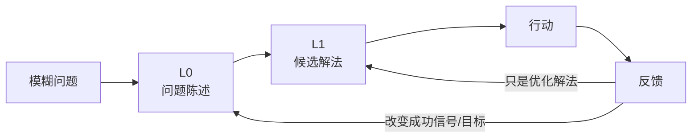
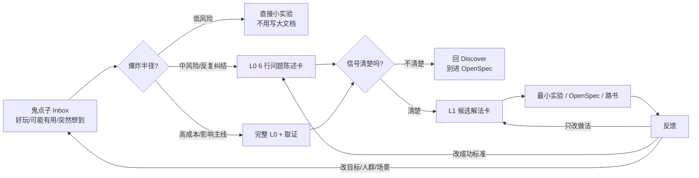

> **公理继承 / Axiom Inheritance**
> 本 skill 服从顶层公理 `typed evidence gates action`——
> 未经类型化（三色 + authority + kind）的上下文不允许驱动行动。
> 在该公理下，本 skill 只给高不确定、高反复或高爆炸半径问题加 gate；
> 低成本可逆尝试允许直接行动，用反馈回收即可。

# Problem Statement Card

## 核心定位

本 skill 是双钻模型里 **钻石 1（Discover + Define）** 的轻量工具：



它不是“任何想法行动前的强制审批”。它只处理一种情况：**问题本身还没被压成可观测陈述，导致后面的解法选择无法裁决**。

## L0 是什么

`L0` 是 **Level 0：问题定义层**。它位于所有方案、任务、OpenSpec、路书之前，回答：

- 我到底在解决谁的什么问题？
- 什么信号证明它变好了？
- 什么信号证明它变差了？
- 这个问题值不值得进入解法选择？

不要把 L0 理解成"更大的 Todo"。L0 只负责定义问题，不负责选方案。

| 层级 | 负责什么 | 典型产物 |
|---|---|---|
| L0 | 锁问题：用户/场景/成功信号/失败信号/爆炸半径 | 问题陈述卡 |
| L1 | 锁解法：2-4 个候选方案、取舍、默认建议 | `knowledge-card-qa` 决策卡 |
| L2 | 画结构：事实链、方案链、风险链、裁决图 | `problem-review-mapper` 图 |
| L3+ | 查证据、落文档、排路书、执行验收 | curator / wiki / roadmap |

口诀：**L0 问"问题是不是对的"，L1 问"哪个解法更适合"，后面才问"怎么做完"。**

L0 进入解法选择前必须过三类逻辑校准：

| 检查 | L0 里的问题 |
|---|---|
| `logical-grammar` | 用户、场景、问题对象、状态和动作能不能合法组合 |
| `truth-condition-checker` | 成功信号、失败信号、反馈周期是否能判断真/假 |
| `say-show-boundary` | 愿景、审美、方向感是否被误写成事实结论 |

## 先做风险分流

先判断爆炸半径，再决定要不要写卡。

| 类型 | 判断 | 动作 |
|---|---|---|
| 低风险 | 可逆、低成本、1 天内能看到反馈 | 直接试；不用卡 |
| 中风险 | 会反复纠结、会影响多个后续动作 | 写 6 行轻量卡 |
| 高风险 | 不可逆/半不可逆、影响方向、多人协作、成本高 | 写完整卡，必要时先取证 |

判断口径：

- 可逆 + 快反馈 = 先行动，后归纳。
- 半可逆 + 会反复 = 轻量 L0。
- 不可逆 + 高成本 = 完整 L0，不要直接进解法。

## 鬼点子决策漏斗

当输入是一堆"鬼点子"、灵感、候选玩法、商业小实验或产品脑洞时，不要一上来评判好坏，也不要直接写 OpenSpec。先放进漏斗：



漏斗只做分派，不做审判：

| 问题 | 用来判断 |
|---|---|
| 它解决哪个用户/场景？ | 是否有对象，而不只是"酷" |
| 成功信号是什么？ | 点击、完成、留存、分享、发布率、识别成功率、付费意愿等 |
| 失败信号是什么？ | 用户绕开、误触、理解不了、生成慢、维护成本上升 |
| 反馈多久看到？ | 当天能测就直接试；几周才知道就要写 L0 |
| 爆炸半径多大？ | UI 小实验、schema、付费规则、主链路稳定性不是一回事 |
| 和当前主线冲突吗？ | 冲突不一定错，但要知道它改的是 L0 还是 L1 |

默认输出格式：

```md
结论：直接试 / 先写 L0 / 暂停 / 丢弃

为什么：
- 爆炸半径：
- 反馈速度：
- 成功信号：
- 失败信号：
- 和当前主线关系：

最小实验：
- 只做 ___
- 不做 ___
- N 天内看 ___
```

## 何时用 / 何时不用

| 触发信号 | 解读 | 动作 |
|---|---|---|
| "我有 N 个解法不知道选哪个" | 可能是问题未定义，也可能只是选型 | 先写 6 行卡；若问题已清晰则转 `knowledge-card-qa` |
| "功能好不好用 / 好不好看 / 有没有趣" | 成功信号不可观测 | 写卡 |
| "看不到决策后果" | 没有成功/失败信号或反馈周期 | 写卡 |
| "激进 vs 保守取哪个" | 性格标签被误用成决策维度 | 改用可逆性、反馈速度、爆炸半径 |
| "AI 给的证据都对但我还是不踏实" | AI 在替你合理化解法 | 让 AI 找失败信号、隐藏前提、反例 |
| 新反馈和旧决策打架 | 先分辨反馈类型 | L0/L1/新卡分流，不能一律重写 |
| 低成本可逆尝试 | 不需要定义完整问题 | 直接试，记录反馈 |
| 解法已清晰要选哪个 | 这是钻石 2 | 转 `knowledge-card-qa` |
| 排查 bug / 长材料 review | 这是事实重构 | 转 `problem-review-mapper` |

## 轻量卡模板

默认只写 6 行。写不出来再回 Discover，不要补长文。

```md
### 问题陈述卡：<开放问题名>

How might we _________________________________？
用户/场景：____ 在 ____ 场景下
成功信号：____（数字 / 状态 / 时间窗）
失败信号：____（什么发生就说明方向错了）
反馈周期：____ 天/小时内能看到
爆炸半径：可逆 / 半可逆 / 不可逆；最坏后果是 ____
```

## 完整卡模板

高风险或多人协作时，才升级到完整卡。

```md
### 问题陈述卡：<开放问题名>

**How might we** _________________________________________？
（必须能写成一句话；写不出 = 继续 Discover）

**Stakeholder + 真实期望**：
- A（如：用户）：希望 ___
- B（如：我自己 / 团队 / 老板）：希望 ___
- C（如：商业指标 / 转化率）：希望 ___

**可观测的成功信号**：
- 信号 1：____（必须带数字 / 状态 / 时间窗）
- 信号 2：____
- 信号 3：____

**可观测的失败信号**：
- 信号 1：____
- 信号 2：____

**不做 / 排除**：
- ____
- ____

**反馈周期**：__ 天内能看到信号
**爆炸半径**：失败的最坏后果是 ____（可逆 / 半可逆 / 不可逆）
**注意力预算**：值得花的 attention 上限是 ____

**证据**（Discover 阶段收集的事实）：
- __________

**失效条件**：
- ___
- ___
- 反馈周期到了但信号都看不到 → 信号定义有问题
- 新反馈改变成功信号 / 目标用户 / 场景 → 回 L0
```

## How might we 句式 — 钻石 1 收敛的关键

把模糊期望压成单句：

| 模糊表达 | How might we 改写 |
|---|---|
| "这个功能好不好用" | "How might we 让 X 用户在 Y 场景下 < N 秒完成 Z？" |
| "好不好看" | "How might we 让 X 群体首次看到时点击 CTA 的概率 > N%？" |
| "提升转化率" | "How might we 让 step-A → step-B 的转化率从 N1% 提到 N2%？" |
| "有没有趣" | "How might we 让 X 用户在使用 N 分钟后愿意分享给朋友？" |

写不出 `How might we` 时，不要硬选方案。先问三个 Discover 问题：

- 谁在什么场景下遇到问题？
- 什么信号会证明它变好了？
- 什么信号会证明它变差了？

如果原始表达是“更高级 / 更自然 / 更有趣 / 方向更对”，先用 `say-show-boundary` 改写成：

- 取向：我们偏向什么体验或价值。
- 约束：因此不做什么。
- 可观察后果：用户或系统会出现什么信号。
- 代价：它可能牺牲什么。

## 反馈分流

新方案或新反馈出现时，不要默认理解成"冲突"，先判断它改的是哪一层。

| 反馈类型 | 例子 | 去哪里 |
|---|---|---|
| 解法优化 | 同一目标下 B 比 A 更省、更快、更好看 | 回 L1 选解法 |
| 信号变化 | 原本看点击率，后来发现留存才是核心 | 回 L0 改成功信号 |
| 问题变化 | 用户、人群、场景或商业目标变了 | 新开一张 L0 卡 |
| 信号缺失 | 到反馈周期仍看不到任何信号 | 回 Discover，重写信号 |

口诀：**只改做法，回 L1；改判断标准，回 L0；改问题对象，开新卡。**

## Johnny 三原则在卡片里的位置

| 三原则 | 卡片字段 | 句法 |
|---|---|---|
| SSOT 准确性 | 用户/场景 + 成功/失败信号 | 必须可证、可对齐 |
| Fast Feedback | 反馈周期 | 越短越好；超过周期没信号，先怀疑信号定义 |
| Attention Budget | 爆炸半径 + 注意力预算 | 不可逆才需要高 attention；可逆就放手试 |

## 路由

| 场景 | 路由 |
|---|---|
| Discover 阶段画图理解材料 | `problem-review-mapper` 画事实链 |
| Discover 阶段查现有素材 | `project-wiki` 跑 hit-detect |
| Discover 阶段裁决素材白灰黑 | `project-knowledge-curator` |
| 陈述卡 lock 后选解法 | `knowledge-card-qa` 扔 2-4 候选 |
| 解法落地编排执行 | `project-roadmap-board` |
| 后端涉及 tech_design | `dq-be-tech-design` |

## 失败模式

- 把所有想法都拦下来填卡 → 行动派会被拖死。先看爆炸半径。
- 成功信号写"做好"、"用得舒服"、"有意思" → 不可观测，等于没写。
- 把"激进/保守"当决策维度 → 改用可逆性、反馈速度、爆炸半径、证据强弱。
- 反馈出现就一律回 L0 → 过度纠偏。先按反馈分流表判断。
- 把一张卡塞 3 个 `How might we` → 一卡一问题，多问题拆多卡。
- 把陈述卡写成权威结论 → 陈述卡默认是 gray knowledge，未来可被修正。

## 生命周期

```
风险分流 → 轻量/完整 L0 → L1 解法选择 → 行动 → 反馈分流
               ↑                              │
               └──── 只有信号/目标变化才回 L0 ┘
```

陈述卡是 **gray knowledge by default**：它是当下证据下的最佳问题归纳，未来反馈可以让它升 white、降 black 或被替代。事后修正不是失败，但也不是所有修正都要重写问题本身。

## 落卡判断

继承 `knowledge-card-qa` 的判断标准：

| 场景 | 落不落卡 |
|---|---|
| 一次性、私人决策（"晚饭吃啥"） | 不落 |
| 高频重复（"每次做新功能都纠结好不好看"） | 落 |
| 跨项目复用（"任何转化率优化都套这卡"） | 落到 `~/docs/<域>/problem_statements/` |
| 重大不可逆（创业方向、人生选择） | 必落 + 跨年保留 |

## 公理继承的具体落点

`typed evidence gates action` 在本 skill 表现为：

- "我有一个想法" 可以驱动低风险尝试，但不能驱动高风险方向选择。
- "AI 说这个对" 不能直接驱动行动；让 AI 找失败信号、隐藏前提和反例。
- "我直觉觉得"、"这个更好看/更高级/更有趣" 可以进入 Discover 当取向输入，不能单独成为事实结论。
- 中高风险开放问题未经失败信号，不进入 L1 候选解法选择。

## 元层洞察

如果你发现：对项目能写卡，对自己写卡时卡住，通常不是缺方法，而是你在要求问题陈述一次正确。强制承认：**问题陈述卡和解法卡一样可错**。但也要反过来防止过度方法化：可逆的小事直接试，不要把 L0 变成新的内耗工具。
