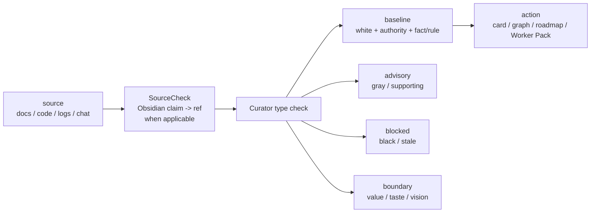

> **公理继承 / Axiom Inheritance**
> 本 skill 服从顶层公理 `typed evidence gates action`——
> 未经类型化（三色 + authority + kind）的上下文不允许驱动行动。
> 在该公理下，本 skill 的职能：给业务域知识打类型（三色 + authority + kind），错知识降权归档

# Project Knowledge Curator

执行位置：仓库根目录。

## 核心目标

这不是一个“帮忙写几篇文档”的 skill，而是一个**知识校准器**：

- 所有 Code 必须先由经过知识校准的 Docs / Knowledge 驱动
- 先确认业务域，再读 docs
- 先索引，再放进默认上下文
- 先做 authority 分级，再给 Worker 用
- 发现错知识时，让它退出默认上下文

## 与 Context Compiler 的关系

本 skill 是知识类型系统。它负责回答一个问题：

> 这段 context 凭什么能驱动行动？

Docs、会议、日志、代码分析和聊天总结都只是 source。它们必须被标注为 `knowledge_kind`、`knowledge_color`、`authority_level`、`claim_type` 后，才能进入 Knowledge Pack、卡片、图、路书或 Worker Pack。

`canonical-claim-compiler` 负责把 PRD / 自然语言编译成 pending / accepted concept 和 claim；Curator 负责把“人或 owner 的 identity 裁决”写进知识治理层。LLM 可以提出 `same_as / not_same_as / merge / supersede` 候选，但不能替人决定两个 concept 或 claim 是不是同一个。

如果 source 来自 Obsidian wiki，进入治理前还必须先通过 SourceCheck：claim 必须能按 `业务域文件夹 + #业务标签 + [[功能点]] + Obsidian ref` 精确指回原文。SourceCheck 只证明引用对得上，不自动生成白知识。

更准确的公理是：

> 未经类型化的 context 不能驱动行动。

因此，“Docs 驱动 Code”不能理解为“文档天然正确”。正确链路是：

## 三类逻辑校准

Curator 是知识类型系统，需要显式消费三类逻辑检查：

| 检查 | Curator 的职责 |
|---|---|
| `logical-grammar` | claim 的对象、关系、状态必须成句；对象域错了不能进入 Knowledge Pack |
| `truth-condition-checker` | white 候选、Conflict Verdict、Repair Record 必须有 support/refute 条件 |
| `say-show-boundary` | `fact/rule` 与 `value/taste/vision/decision` 分区；价值/审美/愿景不能变成白知识 |

## Canonical Paths
- Obsidian仓库： `/Users/kim/code/narnia/narnia-docs-kim`
- Skill 入口：`skills/project-knowledge-curator/SKILL.md`
- 读写合同：`skills/project-knowledge-curator/references/read-write-contract.md`
- Knowledge Pack 模板：`skills/project-knowledge-curator/references/knowledge-pack-template.md`
- 三色知识沉淀模板：`skills/project-knowledge-curator/references/tricolor-knowledge-settlement-template.md`
- Conflict Verdict 模板：`skills/project-knowledge-curator/references/conflict-verdict-template.md`
- Repair / Discard 策略：`skills/project-knowledge-curator/references/repair-discard-policy.md`
- 配套主 skill：`skills/project-roadmap-board/SKILL.md`

## 运行时输入

每次使用本 skill 都必须先明确：

- `docs_root`
- `vault` 或等价知识库入口
- `business_domain`
- `feature_point`
- `authoritative_roots`

如果用户没有明确给出 `business_domain`，先问用户，不要直接开始大规模读码。

如果当前任务没有相关 `[[功能点]]` 或业务域文档，先和用户确认是否需要补收集业务域知识，再进入设计或代码执行。

## 读取顺序

固定顺序：

1. `rg/grep` 业务域 README 与 `[[功能点]]`
2. `obsidian-cli`
3. MCP 兜底

只要前一步已经拿到足够事实，就不要继续扩大上下文。

## 可插拔子能力

`Knowledge Curator` 不是只在“明确写 docs”时才运行。它默认包含 5 个可插拔子能力：

- `identity-legislation`
  - 接收 `canonical-claim-compiler` 输出的 pending terms / pending claims
  - 根据用户或 owner 裁决执行 accept / merge / reject / rename / supersede
  - 输出：
    - `accepted_concept`
    - `accepted_claim`
    - `merged_into_existing`
    - `rejected_pending`
    - `superseded_by`
    - `needs_owner_decision`
- `knowledge-hit-detect`
  - 判断当前对话、设计、实现、排障是否命中已有知识
  - 输出：
    - `no_hit`
    - `hit_readonly`
    - `hit_writeback_required`
- `knowledge-curate`
  - 真正做知识分类、三色收敛、索引吸收、叶子 note 合并和 writeback
- `knowledge-link-audit`
  - 检查 `README.md`、`knowledge/README.md`、`[[功能点]]` 和叶子知识 note 的双链是否断裂
  - 输出：
    - `ok`
    - `missing_wikilink`
    - `missing_index`
    - `orphan_note`
- `claim-source-check`
  - 检查 claim 是否能按 Obsidian 结构精确指回原文
  - 输入来自 `<业务域>/knowledge/sourcecheck.jsonl`
  - 输出：
    - `ok`
    - `invalid_domain`
    - `missing_business_tag`
    - `missing_feature_point`
    - `broken_wikilink`
    - `missing_heading_or_block`
    - `line_out_of_bounds`
    - `boundary_not_found`
    - `boundary_not_unique`
    - `source_drift`

固定触发规则：

- PRD / 设计稿 / LLM 总结首次进入知识库前，先由 `canonical-claim-compiler` 产出 pending / accepted 候选，再由 `identity-legislation` 承接人类裁决。
- 进入设计、实现、排障前，先触发一次 `knowledge-hit-detect`
- 对话形成 durable knowledge、代码变更完成、spec 变化、Exception 产生后，再触发一次 `knowledge-hit-detect`
- 若结果是 `hit_writeback_required`，必须进入 `knowledge-curate`
- 每次 Curator writeback 前后都要跑 `knowledge-link-audit`
- 发现断链时，即使没有新知识，也必须先修复索引或双链
- 对要进入 `locked facts`、白知识候选、路书锚点或 Worker Pack 的 Obsidian claim，必须先跑 `claim-source-check`

## Docs-Driven 规则

- 所有代码工作都必须先经过 `Docs Read`
- 没有相关业务域和 `[[功能点]]` 时，不能直接把假设写成方案或代码
- 业务域必须以文档库中的文件夹形式组织
- 每个业务域目录下固定建立 `knowledge/` 子文件夹，业务知识默认写入 `<business_domain>/knowledge/`
- 每个业务域的 `knowledge/README.md` 必须吸收所有 durable knowledge 的索引入口，不等待用户提醒
- 业务域文档标题或副标题必须带有可检索的业务域标签，例如 `#用户`
- 功能新增、功能修改、或首次进入一个从未治理过的业务域时，必须补 `[[功能点]]` 双链
- 文档写回必须保证后续可以通过业务域标签和 `[[功能点]]` 搜到
- Knowledge Curator 必须主动判断是否应该压缩、合并、整理已有知识，不要等用户提醒
- 当已有 note、README、双链足够承载新结论时，优先更新和合并，避免继续平铺新 note

## authority 分级

- `A.authoritative`
- `B.supporting`
- `C.evidence`
- `D.stale/legacy`

默认 `Knowledge Pack` 只收：

- 所有 `A`
- 与当前功能点直接相关的 `B`

`C` 只能被引用，不能整份塞进上下文。`D` 默认不进入上下文。

SourceCheck 通过只是进入 authority / 三色判定的前置门槛：低权威 source 即使引用对得上，也不能直接进白知识；SourceCheck 失败的 claim 不能进入 `locked facts`。

## 三色知识分层

authority 分级描述“证据强度”，三色分层描述“默认使用策略”。两者并存，不能互相替代。

- `white knowledge`
  - 已确认有效的默认基线
  - 可以进入默认 `Knowledge Pack`
  - 允许沉淀为 `locked facts`
- `gray knowledge`
  - 待确权或经验性知识
  - 只能按需进入 `Knowledge Pack`
  - 可以参考，但不能直接提升为 `locked facts`
- `black knowledge`
  - 已弃用、已归档或明确不应继续暴露的知识
  - 默认不进入执行上下文
  - 不能被 Worker 或 Runner 当作可用依据

固定规则：

- 新产生的知识默认进入 `gray knowledge`
- `gray knowledge` 只有在当前任务、双链、反链或人工明确点名命中时，才允许进入 advisory 上下文
- `black knowledge` 不删除，只隔离；恢复时必须先回到 `gray knowledge`，不能直接恢复为 `white knowledge`
- `white knowledge` 是默认基线，但不代表它永远正确；发生冲突时仍要走 `Conflict Verdict` 和 `Repair Loop`

## 知识双轴模型

三色描述“默认使用策略”，知识类别描述“这条知识是什么”。两者正交，必须同时存在。

- `knowledge_kind`
  - `prd`
    - 功能目标、业务规则、用户流、验收口径
  - `constraint`
    - 必须遵守的规则、门闩、流程限制、禁止事项、环境约束
  - `architecture`
    - 模块边界、数据流、对象模型、控制面和集成关系
- `knowledge_color`
  - `white`
  - `gray`
  - `black`
- `authority_level`
  - `A.authoritative`
  - `B.supporting`
  - `C.evidence`
  - `D.stale/legacy`
- `claim_type`
  - `fact`
  - `rule`
  - `inference`
  - `value`
  - `taste`
  - `vision`
  - `decision`

固定规则：

- 每条 durable knowledge 都必须同时带有 `knowledge_kind`、`knowledge_color`、`authority_level` 和 `claim_type`
- `knowledge_kind` 不是目录结构；业务域仍然是第一层目录
- `knowledge/README.md` 必须固定分为 `PRD知识`、`约束知识`、`架构知识`
- 每个知识类别内部再按 `白知识`、`灰知识`、`黑知识` 组织索引
- `main-phase` 的 PRD / OpenSpec 若仍为当前有效真源，优先作为 `white knowledge` 的 canonical source 被索引
- `claim_type=fact/rule` 是 **white-eligible**：authority、freshness、support/refute 条件都过关后才升 white；不是默认 white
- `claim_type=inference` 默认进 gray；补齐 `support_conditions` 并通过 `truth-condition-checker` 后可升 white
- `claim_type=value/taste/vision/decision` 永远不进 white；只能作为取向、约束或设计原则，不能单独驱动 Worker Pack

## 输出物

### Knowledge Pack

给主 Agent 和 Worker 的最小知识上下文，字段固定为：

- 业务域
- 功能点
- authoritative sources
- baseline sources（白知识）
- advisory sources（按需命中的灰知识）
- blocked sources（黑知识或本轮禁用知识）
- claim refs（SourceCheck 通过的 claim → Obsidian ref）
- accepted concepts（如本任务依赖 canonical identity）
- accepted claims（如本任务依赖 canonical proposition）
- pending claims（只作为待裁决，不进入 Worker Pack baseline）
- superseded claims（说明旧 claim 如何退出默认上下文）
- locked facts
- open conflicts
- stale sources to ignore
- boundary claims（value / taste / vision / decision，不进入 locked facts）
- writeback targets

### Knowledge Hit Detection

给 Main Agent 和 Worker 的知识命中判断结果，字段固定为：

- `knowledge_hit_status`
  - `no_hit`
  - `hit_readonly`
  - `hit_writeback_required`
- `matched_business_domain`
- `matched_feature_points`
- `matched_sources`
  - `path`
  - `knowledge_kind`
  - `knowledge_color`
  - `authority_level`
  - `business_domain`
  - `feature_point`
- `selected_knowledge_color`（white / gray / black；`no_hit` 时为空）
- `selected_authority_level`（A / B / C / D；`no_hit` 时为空）
- `writeback_reason`

### Knowledge Link Audit

用于检查业务域知识结构是否健康，字段固定为：

- `link_health`
  - `ok`
  - `missing_wikilink`
  - `missing_index`
  - `orphan_note`
- `findings`
- `repair_targets`

`baseline/advisory/blocked` 中的每一条 source 都必须带：

- `path`
- `claim_id`（如该 source 支撑 locked fact / 路书锚点 / Worker Pack）
- `feature_point`
- `business_domain`
- `business_tag`
- `source_ref`（wikilink / block_id / line span / string boundary）
- `relation`（support / refute）
- `confidence`
- `sourcecheck_status`
- `knowledge_kind`
- `knowledge_color`
- `authority_level`
- `claim_type`

`accepted_claims` 中每条必须带：

- `claim_id`
- `canonical`
- `truth_condition`
- `concept_refs`
- `depends_on`
- `semantic_status`
- `source_ref`
- `local_truth_hash`
- `closure_truth_hash`

### Conflict Verdict

状态固定为：

- `aligned`
- `missing`
- `conflicting`
- `stale`
- `superseded`

每个 Verdict 必须补：

- `support_conditions`
- `refute_conditions`
- `contradictions`

写不出 support/refute 条件时，先交给 `truth-condition-checker`，不要把裁决升成 white knowledge。

### Knowledge Repair Record

用于记录错知识如何退出默认上下文，以及谁接替成为真源。

### Tri-Color Knowledge Settlement

用于把一次会话、一次执行或一次争议收敛成白 / 灰 / 黑知识，而不是直接保存原始对话转录。

## 回写规则

- 所有文档使用中文
- 使用 Obsidian 友好 Markdown
- 当文件名已经承担标题作用时，正文不要再重复写同名 `# H1`
- 业务域以文件夹组织
- 每个业务域必须有一个 `README.md` 根索引
- 每个业务域必须有一个 `knowledge/README.md` 知识索引
- `knowledge/README.md` 固定只维护三类一级索引：
  - `PRD知识`
  - `约束知识`
  - `架构知识`
- 每个一级索引内部固定维护三类颜色分区：
  - `白知识`
  - `灰知识`
  - `黑知识`
- 功能新增或修改时，补 `[[功能点]]`
- 业务域文档需要带有对应的 `#业务域` 标签
- 要进入 `locked facts` 的 Obsidian claim，必须能从业务域 README 或叶子页反查到对应 `[[功能点]]`
- 要进入 `locked facts` 的 Obsidian claim，必须有 SourceCheck `ok` 的 `claim_id/source_ref`
- `canonical-claim-compiler` 输出的 pending term / pending claim 不允许直接写进白知识；必须先由人或 owner 裁决为 accepted / merged / rejected / superseded
- accepted concept / claim 的 id 一旦写入主库，不在原地改名；语义换代用 `supersedes / superseded_by`
- 代码落点格式固定为：
  - `功能名 符号名 @filename#L{start}-L{end}`
- 工具函数默认不作为业务知识落点记录，除非用户明确要求
- 写回时优先更新业务域 README 与 `[[功能点]]` 叶子文档，再补充关联结论
- 若已有真源文档能够承载结论，优先在 `knowledge/README.md` 中索引该真源，不重复抄写正文
- 若发现 `[[功能点]]`、`knowledge/README.md` 或叶子知识 note 未被互相索引，必须优先修复双链

## Repair Loop

发现错知识时，固定执行：

1. 标记 `conflicting` 或 `stale`
2. 从业务域 README 和默认 `Knowledge Pack` 中移除
3. 降级为 `D.stale/legacy`
4. 写回替代真源
5. 生成 `Knowledge Repair Record`
6. 从 README 根节点重新组织调研路径
7. 产出新的 `Knowledge Pack`

默认策略是“降权 + 归档 + 重新索引”。

如果采用三色知识分层，再附加以下动作：

8. 白知识失效时，退出 `white knowledge`
9. 废弃或禁止复用的内容进入 `black knowledge`
10. 黑知识若需要重新讨论，先恢复到 `gray knowledge`，再决定是否返白

## 不要做的事

- 不要在没有业务域的情况下直接给代码方案
- 不要把整份 HAR、整份长日志塞进默认 `Knowledge Pack`
- 不要让错知识继续留在业务域 README 的默认索引里
- 不要让 Worker 私自回写业务知识结论
- 不要让 LLM 私自裁决两个 concept / claim 是不是同一个
- 不要把 pending term / pending claim 写成 accepted 或 locked fact
- 不要把 `gray knowledge` 直接写成 `locked facts`
- 不要把没有 SourceCheck `ok` 的 Obsidian claim 写成 `locked facts`
- 不要把 SourceCheck `ok` 等同于 `white knowledge`
- 不要让 `black knowledge` 进入 Worker 或 Runner 的默认知识包
- 不要无限创建新的知识分类文件夹；优先压缩到既有业务域目录及其 `knowledge/` 子目录
- 不要把 `PRD / 约束 / 架构` 做成新的并列目录树；它们只存在于 `knowledge/README.md` 的索引结构和知识项元数据里
- 不要等用户提醒才做知识压缩、命中判断和断链修复；这属于 Curator 的默认职责
