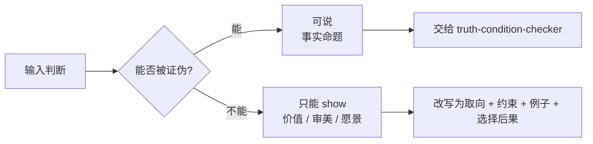

# Say Show Boundary

本 skill 区分两类东西：

- **可说**：能写成事实命题，能被证据支持或反驳。
- **只能 show**：价值、审美、愿景、品味、伦理边界、方向感。它们不能被当作事实证明，只能通过选择、约束、例子、体验和后果展示。

目标不是禁止价值判断，而是防止 agent 把价值判断伪装成事实，污染后续决策。

## 判断流程



## 快速判别

| 表达 | 类型 | 处理 |
|---|---|---|
| “日志里出现了 X” | 可说 | 查日志验证 |
| “这个字段由服务端写入” | 可说 | 查代码/契约验证 |
| “这个体验更高级” | 只能 show | 改成品味标准和例子 |
| “这条路更正确” | 只能 show | 改成目标取向和代价 |
| “用户会更喜欢” | 混合 | 拆成假设、观测指标、价值取向 |
| “我们应该保持克制” | 只能 show | 改成设计原则和拒绝事项 |

## 纠正方式

当用户或 agent 把价值判断伪装成事实时，必须提示并改写：

```md
这里不是事实命题，不能直接用证据证明。
它更像一个 <价值/审美/愿景/伦理> 取向。

可改写为：
- 取向：我们偏向 ...
- 约束：因此不做 ...
- 可观察信号：如果这个取向被执行，用户/系统会看到 ...
- 反例/代价：它可能牺牲 ...
```

不要只说“这是主观的”。要给出能继续工作的表达方式。

## 输出格式

```md
结论：可说 / 只能 show / 混合命题

原句：
<用户或 agent 的判断>

拆分：
| 片段 | 类型 | 为什么 | 下一步 |
|---|---|---|---|
| ... | fact/value/aesthetic/vision/ethic | ... | 验证 / 改写 |

纠正后的说法：
- 可说事实：
- 只能 show 的取向：
- 决策约束：
- 可观察后果：
```

## 混合命题处理

很多产品判断是混合命题，要拆开：

```md
“这个方案会让体验更自然。”
```

拆成：

- 可说事实：交互步骤减少、等待时间降低、错误率下降、用户不用理解内部术语。
- 只能 show：我们偏好低解释成本、少打断、动作像日常习惯。
- 验证方式：可观测指标或用户测试。
- 决策约束：即使指标相近，也优先选择解释成本低的方案。

## 常见反模式

- 把“高级”“正确”“自然”“有趣”“克制”直接写进验收条件。
- 用用户价值判断替代事实验证。
- 用数据强行证明审美取向；数据最多证明某些可观测后果。
- 因为价值不能证伪，就把它丢掉。正确做法是把它改成选择原则、拒绝事项和例子。
- 把只能 show 的愿景写成不可挑战的事实，导致后续 agent 误以为已经验证。

## 与其他 skill 的关系

- `logical-grammar`：先判断对象、关系、状态能不能合法组合。
- `truth-condition-checker`：只处理可证伪的事实条件、gate 和 decision。
- 本 skill：处理事实验证之外的价值、审美、愿景和边界表达。
