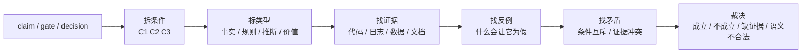

# Truth Condition Checker

本 skill 把判断拆成真值条件：什么为真时它成立，什么为假时它失败，哪些条件互相矛盾。

它不负责发明方案，也不负责把不合法语法强行验证。若对象、关系、状态还没成句，先用 `logical-grammar`。

## 核心分工

| 输入 | 处理 |
|---|---|
| claim | 拆成事实条件、证据条件、反例条件 |
| gate | 拆成放行条件、拒绝条件、未知条件 |
| decision | 拆成选择成立条件、退出条件、风险条件 |
| incident conclusion | 拆成观测事实、因果条件、排除项 |
| acceptance criteria | 拆成可观测信号和失败信号 |

## 判断流程



## 条件拆分

每个条件必须能回答三件事：

| 字段 | 要求 |
|---|---|
| 条件 | 用可验证句子写，不写感受词 |
| 证据 | 指向代码、日志、配置、数据、文档或用户明确裁决 |
| 失败方式 | 写出什么发生时该条件为假 |

如果写不出失败方式，这个条件通常不是事实条件，可能是价值、愿景或偏好，交给 `say-show-boundary`。

## 输出格式

```md
结论：成立 / 不成立 / 缺证据 / 条件冲突 / 不是事实命题

原判断：
<claim / gate / decision>

真值条件：
| 条件 | 类型 | 当前证据 | 反例/失败方式 | 状态 |
|---|---|---|---|---|
| C1 | fact/rule/inference/value | ... | ... | 真/假/未知 |

矛盾：
- <条件 A> 与 <条件 B> 冲突，因为 ...

裁决：
- 可以继续依赖：
- 不能继续依赖：
- 需要补证：
```

## 矛盾类型

| 类型 | 例子 |
|---|---|
| 条件互斥 | 同一对象同时要求 `created` 和 `not_created` |
| 层级冲突 | 用 UI 展示状态证明后端持久状态 |
| 时间冲突 | 用变更后的日志证明变更前的事故 |
| 证据冲突 | 代码路径和运行日志指向不同结论 |
| 量词过强 | 从“一次成功”推出“总是成功” |
| 伪事实 | 把“应该更高级”当成可证伪 claim |

## Gate 检查

对 gate 不要只问“能不能过”，要拆成：

- 放行条件：全部为真才允许继续。
- 阻断条件：任一为真就必须停。
- 未知条件：缺证据时不能冒充已通过。
- 退出条件：后续哪个事实变化会让 gate 失效。

## Decision 检查

对 decision 先写清楚“选择成立条件”，再写清楚“不选什么”：

- 该选择依赖哪些事实为真？
- 哪些事实为假时必须换方案？
- 它替代或丢弃了哪个旧判断？
- 是否存在价值判断伪装成事实条件？

## 禁止动作

- 不要用“我感觉合理”当证据。
- 不要把未知条件默认为真。
- 不要只找支持证据；必须写反例或失败方式。
- 不要用兜底实现掩盖条件冲突；先解释为什么冲突会出现。
- 不要把价值、审美、愿景硬拆成事实真值；交给 `say-show-boundary`。
