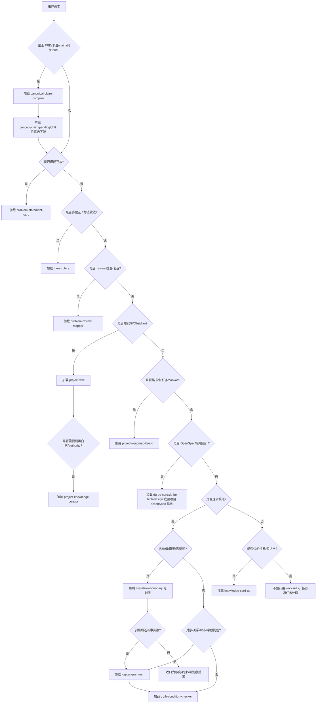

# Workskills Router

这是 `/Users/kim/code/workskills` 的唯一入口 skill。它不替代下游 skill，也不复制它们的规则；它只负责把用户请求路由到正确 skill，并控制上下文加载量。

## 核心规则

- 默认只选 **1 个主 skill**。
- 只有当主 skill 明确需要业务知识、路书、OpenSpec、卡片沉淀或引用校验时，才追加第二个 skill。
- 先读下游 skill 的 `SKILL.md`；只有触发到细节，才读 `references/*` 或运行 `scripts/*`。
- 不要一次性读取整个 `/Users/kim/code/workskills`。
- 对于多步链路、可见结果或用户表象需要校准的任务，先走 `stage-evidence-gate` 做跨语言证据门：记录用户现象，编译共通概念/claim，选择本轮证据面和停止条件。router 不硬编码实现侧语言；具体实现词只能在当前项目证据计划或示例里出现。
- 对于开放、不确定、低先例或跨域问题，不能把代码库当成封闭世界。先把外部成熟解法、官方能力边界、论文/开源实现、相邻产品做法编译成先验和候选机制；每条外部参考必须落到 `adopt / reject / pending`，并说明它改变哪个猜想、证据面或下一验。
- 对于任何症状或失败，先把"相关性"和"因果性"分开。大模型可以从许多相关代码里猜一个看似合理的改法，但代码修改必须建立在因果链上：先说明现象的直接机制、可观测预测和能区分猜想的证据面，再决定实现。手机过热时，火焰图只是证明"为什么 CPU/GPU 忙"的一种证据，不是所有性能问题的固定模板。
- 三类逻辑审计先做分流，不在 router 里实现规则：
  - `logical-grammar`：对象 / 关系 / 状态 / 动作能不能合法组合。
  - `truth-condition-checker`：claim / node / gate / decision 什么条件下为真或为假。
  - `say-show-boundary`：事实命题与价值、审美、愿景、偏好边界。
- 当用户前提不成立时，必须提示纠正：说明旧说法为什么不成立、当前证据支持什么、下一步如何改，不要只顺着用户继续执行。
- PRD、设计稿、LLM 总结或用户自然语言要进入 Obsidian / OpenSpec / roadmap 前，先判是否需要 `canonical-claim-compiler`：它负责把 lexical 表达编译成 stable concept / claim / pending / drift，下游只消费 accepted 身份和命题。
- 调度契约（discovery / fanout / subtask exec / pre-finish / skill authoring）见 `references/calibration-hooks.md`。本机 `context-compiler` 是该契约的一种实现，不是契约本身——换机器需重建本机实现，但契约和下游 skill 的"输入前置检查"段始终生效。这是 **router 判 + skill 自检** 双层冗余设计：接受重复，不接受逻辑失效。

## 四方对齐方法链

这套实践不是单个 E2E skill。`stage-evidence-gate` 只负责多步链路的证据门，其他环节分别由下游 skill 承担：

| 方法环节 | 典型问题 | 主 skill |
|---|---|---|
| 问题成形 | 我到底在解决什么、成功/失败信号是什么 | `problem-statement-card` |
| 概念对齐 | 这是不是同一个对象/claim，语义有没有漂移 | `canonical-claim-compiler` |
| 证据门 | 用户现象、共通概念和当前证据面是否互相解释 | `stage-evidence-gate` |
| 多猜想裁决 | 哪个解释领先、走弱、挂起，下一验是什么 | `problem-review-mapper` |
| 真值/边界 | 结论什么条件下为真，哪些只是价值/审美取向 | `truth-condition-checker` / `say-show-boundary` |
| 人话沉淀 | 本轮到底学到了什么，是否需要落卡 | `knowledge-card-qa` |

原则：先把用户现象改写成共通概念和可裁决 claim，再选择证据面；实现侧语言只能作为当前项目的证据投影，不能升级成通用方法准则。

## 快速路由

| 用户在问什么 | 主 skill | 追加条件 |
|---|---|---|
| 问题模糊、方案太多、不踏实、好不好用/好不好看 | `problem-statement-card` | 需要证据校准时加 `problem-review-mapper` |
| 开放/低先例/跨域问题、想看别人怎么做、需要外部参考或类似方案 | `problem-review-mapper`（先验 + 外部类比 + 证据态势图） | 需要沉淀到 Loop / OpenSpec 时按项目指南写 `adopt / reject / pending`；涉及业务知识真伪时加 `project-wiki` + `project-knowledge-curator` |
| 在多个方案里挑/排序、"哪个更好/选哪个/先做哪个/我喜欢哪个"、凭"什么好做"挑东西 | `decision-tripwire` | 标准立完要排序时加 `problem-statement-card`；要落卡时加 `knowledge-card-qa` |
| 甩来对话记录/一堆想法说"思路乱了/想法太多/帮我收敛"、反馈/候选（≥3）要收敛成一版范围、砍方案、（多人或一人不同时刻）各执一词 | `three-rulers` | 锁尺时加 `knowledge-card-qa`；单点取舍转 `decision-tripwire` |
| review、排查、复盘、归因、真因、为什么坏/为什么挂、线上 bug、排错、发热/卡顿/延迟、我感觉不对劲、画图、哪些对/不对 | `problem-review-mapper`（按贝叶斯排查表走） | 先区分相关代码与因果机制；为当前现象选择能区分猜想的证据面（过热可用火焰图/trace）；涉及业务知识真伪时加 `project-wiki` + `project-knowledge-curator` |
| 多步链路、可见结果或 E2E “过了但不知道证明了什么”，需要把用户表象语言翻译成共通概念和本轮证据面 | `stage-evidence-gate` | 根因不明或多猜想竞争时加 `problem-review-mapper`；术语/claim 漂移时先加 `canonical-claim-compiler`；要落 OpenSpec 时再按项目指南 |
| PRD、新需求、设计稿、LLM 总结、术语漂移、Obsidian/OpenSpec 同步、已有知识检索不到 | `canonical-claim-compiler` | 需要实际读写 vault 时加 `project-wiki`；需要 accept/merge/reject 时加 `project-knowledge-curator` |
| Obsidian、知识库、业务域、`#业务`、`[[功能点]]`、补文档、Knowledge Pack | `project-wiki` | 需要判能不能用时加 `project-knowledge-curator` |
| 黑白灰、authority、错知识退出、Conflict Verdict、Repair Loop | `project-knowledge-curator` | 需要实际查/写 vault 时加 `project-wiki` |
| 路书、canvas、进度板、长任务 Loop、子环、状态颜色同步 | `project-roadmap-board` | 涉及业务事实时加 `project-wiki` + `project-knowledge-curator` |
| OpenSpec、后端技术方案、库表/schema、跨服务、架构评审 | `dq-be-core:dq-be-tech-design`（plugin）或项目 `openspec/AGENTS.md` / `openspec-workflow` | 业务事实不清时加 `project-wiki`；执行图需要加 `project-roadmap-board` |
| 快问快答、说人话、知识卡、决策卡、是否落卡 | `knowledge-card-qa` | 先用对应取证 skill 得到证据，再压缩表达 |
| 对象/关系/状态/字段/任务拆分能不能这样连 | `logical-grammar` | 语法合法后再转 `truth-condition-checker` 或领域 skill |
| claim、gate、结论、验收口径是否成立，哪里矛盾，证伪/反向审查/怎么推翻这条链 | `truth-condition-checker` | 需要事实证据时加 `problem-review-mapper` / `project-knowledge-curator` |
| “好/坏/高级/自然/有趣/方向正确”等价值或审美判断 | `say-show-boundary` | 开放问题加 `problem-statement-card`；决策表达加 `knowledge-card-qa` |

## 贝叶斯排查口径（排查/归因类专用）

排查 = 在一堆猜想里用最少验证次数找真因。路由到 `problem-review-mapper` 后按**贝叶斯排查表**走，router 只立口径、不实现表：

- 原因不明 / 多猜想竞争 / 调研推进时，默认要求 `problem-review-mapper` 先画**证据态势图**：同图展示猜想、先验、诊断性证据、混杂、挂起调研和下一验。
- 先验不是只来自代码直觉。开放问题的先验必须显式吸收外部已知解法：官方能力边界、成熟相邻模式、跨域研究/开源实现、竞品/产品范式；外部参考只能改变猜想和实验设计，不能直接把本项目 gate 判绿。
- 材料很多但主要问题是顺序和阶段时，用**流程放射图**；单条 claim / gate / decision 是否成立时，转 `truth-condition-checker` 写真值条件和反向证伪。
- 每个猜想只能处于 `排除 / 走弱 / 挂起 / 领先 / 确认` 五态之一；决断 = 刷状态，不是"选一个答案"。
- 每次刷新状态必须写清「**这条证据只覆盖到哪一层**」——证据打到哪层只能排到哪层，禁止整包排除。
- `领先 ≠ 确认`：单样本 / 跨次方差大的领先不能拿去当根因改实现。
- 两个猜想下都会出现的证据，似然比 ≈ 1，不许更新判断（"查了半天等于没查"）。
- 症状类问题先找因果，不先写修复。相关性只能生成候选猜想，不能授权改代码。比如"手机过热"的第一层 claim 是 CPU/GPU/IO/日志/网络/渲染哪条路径繁忙；"加队列/降频/缓存"只是候选干预，必须等火焰图、trace、日志时间窗或其他可区分实验支持后才能成为实现动作。

图型、表、卡模板和猜想五态定义在 `problem-review-mapper`。

## Loop 方法论

Router 层的 Loop 只是一套**思考方法和协作风格**，不是某个项目的文件模板。它回答的是：用户怎么开始 loop，agent 每轮怎么内采/外采，怎么做决策，决策后怎么继续思考。具体项目里的 `STATE.md`、OpenSpec、E2E、知识卡、设备日志、业务 gate，交给项目 skill 或项目指南内化。

当用户说 loop、循环、长任务、路书、反复 E2E、"每轮怎么决策"、"怎么让 agent 自己持续推进"时，router 先判断这是哪种 loop：

- `开放策略 loop`：问题没现成局部答案，需要外部先验、能力边界、候选机制和 evidence gate。
- `症状排查 loop`：用户或运行结果报告发热、卡顿、延迟、坏图、失败日志等症状，需要先找因果机制。
- `批量探索 loop`：多个独立假设可以并行准备；必须先声明写入边界、共享资源、集成点和 verifier。
- `已知契约 loop`：目标和 gate 已定，只需要按状态文件重跑、验证、回写。

启动 loop 时，不要先派代码任务。先产出或补齐一个方法论入口：

| 项 | 需要写清 |
|---|---|
| Goal | 用户看见的目标现象，用用户语言写。 |
| Non-goals | 本 loop 不证明、不修改、不承诺的范围。 |
| State | 当前可信状态在哪里；具体载体由项目决定，不由 router 规定。 |
| Gates | 哪些 claim 可独立判定，什么条件绿/黄/红。 |
| Badcases | 哪些反例会推翻当前方向。 |
| Evidence | 哪些是 target、proxy、invalid、stale。 |
| Roles | implementer / verifier / human gate 谁能做什么，谁不能自证完成。 |
| Topology | 单线、批量探索、共享稀缺 oracle、还是人工 gate。 |

单轮 loop 按这个顺序走：

1. **锁一个问题**：本轮只处理一个 gate、badcase、claim 或假设，不把多个失败混成"继续优化"。
2. **信息内采**：从当前工作现场取证，包括用户原话、项目文档、代码、日志、测试、历史结论、知识卡、状态文件；标注证据新旧、target/proxy 边界和已失效上下文。
3. **信息外采**：把工作现场之外的材料纳入先验，包括用户在提示词里喂给 agent 的外部内容、官方能力边界、成熟相邻方案、论文、开源实现、竞品或产品范式。外采不等于上网搜索；用户提供的链接、摘录、截图、repo 名称、论文标题也算外部参考。每条外部参考必须落成 `adopt / reject / pending`，并说明它改变哪个先验、候选机制或下一验。
4. **贝叶斯/MoE 决策**：列候选机制、先验、可观测预测、反预测和最有信息增益的证据面；MoE 选择的是下一位专家/工具/worker/验证面，不是直接选一个看起来顺手的补丁。
5. **选择拓扑**：如果多个假设独立，允许批量探索；如果共享真机、生产环境、人工 reviewer、昂贵模型或其它稀缺 oracle，则只能并行准备，oracle 使用必须排队且 WIP 受限。
6. **决定下一动作**：只能是 `report-only update`、`evidence run`、`scoped implementation`、`independent verification`、`human handoff`、`pause/kill` 之一，并写明为什么其他动作暂时不合法。
7. **执行并记录**：每次运行或修改都要有 run_id/session_id/label；执行后分类 artifacts，追加 run log，更新 state。
8. **复盘再思考**：写清本轮淘汰了什么旧猜想、哪个先验变强/变弱、哪个知识卡/文档需要回写、下一轮唯一问题是什么。

跨 agent 的证据交接必须先物化到已确认共享的路径：项目证据用 workspace/repo evidence 目录，不入库临时包用 repo `.git/codex-*` scratch。agent-local `/tmp` 只能是工作缓存，不得成为 handoff pointer。maker 交付 `path + hash/manifest + read probe`，多文件 manifest 必须覆盖每个相对路径、字节数和 hash；共享性只能由 checker 在独立 context 里实际读取、校验后确认。路径不可读时是 evidence blocked，不是可以用 maker 摘要补齐的细节。

可借鉴 `cobusgreyling/loop-engineering` 的运行骨架：L1 report-only 起步、持久状态、run log、readiness/audit、预算/kill switch、maker/checker 分离、必要时隔离工作区。router 只吸收这些作为 loop 方法，不把它们写死成项目模板。具体项目的权威事实、证据 gate、用户可见 claim 和因果链，必须由项目 skill 或项目文档承接。

拓扑选择的通用规则：

- 单线 loop：一个 gate、一个假设、一个证据面；适合回归和已知契约。
- 批量探索 loop：多个 worktree/worker 只能处理独立假设或独立证据面；必须有 owner、写入边界、kill 条件和集成点。
- 共享 oracle loop：当目标证据依赖真机、生产账号、人工评审、昂贵实验、远端环境等稀缺资源时，worktree 只并行做 preflight；oracle 访问必须排队，默认 WIP=1，除非项目 skill 明确记录更多资源。
- verifier lane 可以并行读证据，但不能改它正在验证的实现。
- 并行探索的产物只改变先验和候选机制；目标 gate 仍然只能由项目定义的 target evidence 关闭。

## Concept Convergence Process

### 核心契约

**每次对话提到 concept/claim 时，主 agent 必须先查演进版本，判 primal 用法属于哪版，写 protention 预期。** drift 1-2 次记反常不处理；drift >= 3 触发危机。concept 版本变化时必须重跑推论链回溯所有引用旧版本的决策。

这不是可选优化——是防止"两周后还在原点"的硬约束。同一概念反复被讨论但没收敛，根因是概念没有被当成**随时间演进的实体**，每次对话都从零对齐。

`canonical-claim-compiler` 已扩展了 Concept Evolution Layer：版本化 + 时间厚度（Husserl）+ 视域融合（Gadamer）+ 硬核/保护带（Lakatos）+ drift 累积（Kuhn）+ 推论角色（Brandom 主轴）+ 客观落地 + 决策反向索引（Quine）+ stability_score。router 层只负责何时触发、何时升级 badcase、何时回溯决策。

### 知识与概念的关系

concept 版本文件不是独立于知识库的第二套体系，而是写进项目知识库（如 Mewt 的 `docs/` Obsidian vault），和业务知识文档放在一起：

| 层 | 回答什么 | 例子 |
|---|---|---|
| 知识（业务文档） | 这个业务是什么、规则、流程 | `docs/猫咪/本地猫/13-视角收集整体逻辑与评分体系.md` |
| 概念（concept 版本文件） | 这个词在我们对话里怎么漂的、落地没、影响哪些决策、稳不稳定 | `docs/概念/mewt.viewpoint.head_up.md` |

概念是知识的"演进版本元数据"——知识描述业务事实，概念描述一个 `concept_id` 随时间演进的时间厚度、drift、落地状态、stability_score。两者通过 Obsidian 双链互相关联，不维护两套目录。

**落地方式**：
- concept 文件写进项目知识库 vault（如 `docs/概念/<concept_id>.md`），不单独建 `concepts/` 目录
- 用 Obsidian frontmatter（`业务域` 标签 + `knowledge_kind: concept` + `authority_level`），和业务文档同款格式
- Concept Evolution Layer 的机器可 grep 字段（`code_landed` / `doc_landed` / `drift_state` / `anomaly_count` / `stability_score` / `affects_decisions`）放 frontmatter——Layer 1 客观落地测试能直接 grep
- 用双链 `[[业务文档名]]` 关联业务知识；Obsidian 反向链接面板自动让业务文档看到引用它的 concept，不用手动改业务文档
- 版本演进在单文件内用 `## vN — 日期` 标题，最新在上；双链 `[[concept_id]]` 永远指最新版

**查找约定**：`canonical-claim-compiler` 和 Step A 扫项目知识库 vault 里的 concept 文件，按 `concept_id` frontmatter 字段匹配，不依赖固定目录路径。

### 与 Loop 方法论和 Loop Skill Convergence 的关系

| Loop 方法论 | Loop Skill Convergence | Concept Convergence |
|---|---|---|
| 思考方法 + 协作风格（开放策略/症状排查/批量探索/已知契约） | 处理 harness/工程坑（Detect→Abstract→Propagate→Verify） | 处理概念漂移（Lookup→Track→Reindex） |
| 整体 loop 编排 | 防止工程坑复发 | 防止概念回到原点 |
| 用户说 loop / 循环 / 长任务时触发 | 每轮 loop 触发 | 每次对话提到 concept 触发 |

三者互补，不替代。Loop 方法论管"怎么开始和持续推进 loop"，Loop Skill Convergence 管"工程坑怎么收敛进 skill"，Concept Convergence 管"概念怎么随时间收敛不漂回原点"。

### Step A — Concept Lookup with Temporal Thickness

每次主 agent 路由到 `canonical-claim-compiler` 时强制跑：

1. **查 retention**：这个 `claim_id` 最近版本是什么（查项目知识库 vault 里该 `concept_id` 的 concept 文件，按 `concept_id` frontmatter 匹配，看最新版本段落）
2. **判 primal**：当前对话用法属于哪版
   - 全满足当前版本 → `matches_version: true, drift_signal: none`
   - 部分满足（提到新 sense） → `partial`，记 anomaly
   - 都不满足 → `false`，强制创建新版本或 fork
3. **写 protention**：预期下次用法 + `open_questions`

如果 `claim_id` 不存在 → 首次提及，在项目知识库 vault（如 `docs/概念/<concept_id>.md`）创建 v1（含 Concept Evolution Layer 全部字段 + Obsidian frontmatter）

**关键原则**：主 agent 不能直接说"我懂 head_up"。必须先查演进版本，判 primal 属于哪版。这把"对齐"从瞬时变成有时间厚度的过程。

### Step B — Drift Accumulation Tracking

drift 累积追踪，不立即处理：

| drift_state.state | anomaly_count | 动作 |
|---|---|---|
| normal | 0 | 无 |
| anomaly | 1 ~ crisis_threshold-1 | 记下来，不处理（反常是正常的）|
| crisis | >= crisis_threshold（默认 3）| 触发 `problem-review-mapper` 范式检讨 |
| revolution | crisis 后 | 决定 fork / redefine / reject |

crisis 时必须裁决，不能继续累积。裁决后 `anomaly_count` 清零，state 回 normal。

**升级为 badcase 的判据**：`drift_count >= 2` 且 `landing.code_landed = false` → 升级为 badcase，走 `problem-review-mapper` 强制裁决（adopt/reject/merge/split），不再无限讨论。

### Step C — Decision Reindex on Version Change

concept 版本变化时触发：

1. 扫描该 `claim_id` 的 `affects_decisions` 中所有决策
2. 对每个决策按新版本的 `sense.inferential_role` 重跑推论链（Brandom 主轴）
3. 标记：
   - `ok`：旧决策在新版本下还成立
   - `needs_recheck`：旧决策在新版本下不成立
   - `ambiguous`：判不了，必须人工复检
4. **不自动降级 green → yellow，只标记 needs_recheck**。因为概念变不等于旧决策错——可能旧决策其实用的是新 sense，只是当时没区分清楚
5. 产出"影响清单"给用户

### 演进曲线（人的主观视角）

不做"用户主动看卡"。给一个简单视图，事件驱动 alert + 演进曲线：

```
mewt.viewpoint.head_up    ████████░░ 0.80  (drift 2, code_landed ✓, decisions ok)
mewt.viewpoint.head_down  ███░░░░░░░ 0.30  (drift 5, code_landed ✗, decisions needs_recheck) ← 风险点
mewt.action.bucket        ██████████ 1.00  (converged)
```

漂的就是风险点，收敛的就是稳定点。扫一眼就知道哪个概念还没闭环，不用读卡内容。

`stability_score` 就是用户要的"随时间收敛的双曲线"的 y 轴。

### Drift Alert（事件驱动）

每次 anomaly 出现时主动 alert（不是用户主动查）：

```
[Drift Alert] mewt.viewpoint.head_up
- 最新版本（v3a）: head_pitch_up，viewpoint 维度
- 刚才讨论时用作: action bucket，"抬头看东西"
- 这是 v3b 的 sense，不是 v3a
- 影响的过去决策:
  - G3 gate green（2026-07-08）基于 v3a，sense_used=v3a
  - commit abc123 基于旧 v2
- 建议: 显式选 v3a 还是 v3b，或正式 fork；选 v3b 的话 G3 需要 needs_recheck
```

这就像 git blame——你不主动查，冲突时自然冒出来。alert 是对话的一部分，看到就处理，不用专门翻卡。

### 哲学外因

| Step | 哲学资源 | 解决什么 |
|---|---|---|
| Step A 时间厚度 | Husserl 内时间意识 + Heidegger 此在时间性 | 知道概念"经过迭代" |
| Step B drift 累积 | Kuhn 反常/危机/范式革命 | 什么时候真要处理 |
| Step C 决策回溯 | Quine 整体论 + Brandom 推论主义 | 概念变 → 决策变 |

诚实局限：
- Gadamer 视域融合依赖对话双方诚实，无法强校验
- Kuhn crisis 阈值（默认 3）是经验值，需调
- Brandom 推论角色重跑有成本，复杂决策链可能跑不动

硬在哪：landing（机器 grep）、inferential_role（公开决策）、hard_core（明确 fork 判据）三层不依赖主观判断。

### 落地顺序

1. **先做 Step A 的 retention/primal/protention 记录**——所有其他判据的基础。没有时间厚度，后面都是空的
2. **再做 Step B 的 drift 累积**——有了时间序列才能判累积
3. **最后做 Step C 的决策回溯**——需要 dreaming pass，等数据积累

不要一次全做。Step A 跑 1-2 周积累数据后再上 Step B；Step B 跑稳后再上 Step C。

### 何时触发

- 任何对话里出现已被反复讨论的词（项目可维护高频词表，如 mewt 项目的 `head_up` / `bucket` / `oracle` / `viewpoint`）
- `canonical-claim-compiler` 被路由时
- concept 版本 bump 时（触发 Step C）
- 用户说"这个概念我们之前讨论过"时

### Concept Convergence 反模式

- 主 agent 直接说"我懂 head_up"而不查演进版本——这是两周后还在原点的根因
- 每次 drift 都立刻 fork——Kuhn 反常是正常的，累积到危机才处理
- 把判飘交给 LLM 凭语义判断"用法是否一致"——循环论证，AI 是当事人
- 概念版本变了自动降级所有引用旧版本的决策——必须重跑推论链
- 演进曲线当装饰品——`drift_count >= 2` 且 `code_landed = false` 必须升级 badcase
- 把 concept 文件单独放 `concepts/` 目录不进知识库 vault——和知识两处维护，双链能力失效，drift 时找不到

## 路由流程



## 组合加载

### 复杂 review / 排查

1. 读 `problem-review-mapper/SKILL.md`
2. 如果图里的 claim 涉及业务知识真伪，读 `project-wiki/SKILL.md`
3. 如果要判白/灰/黑或旧知识退出，读 `project-knowledge-curator/SKILL.md`
4. 用户要“说人话/落卡”时，再读 `knowledge-card-qa/SKILL.md`

### 阶段证据门 / 多步链路验证

1. 读 `stage-evidence-gate/SKILL.md`
2. 先重写 goal：用户看见/期待的现象、共通概念/claim、本轮要校准的关系、停止条件
3. 先把用户表象语言翻译成共通概念，再决定需要哪些证据面；不能直接用实现侧词汇替代用户概念
4. 先说明每一步在方法论里的角色：它承接什么、改变什么、交给谁、什么现象会反驳它
5. 具体证据形式由当前 goal 或项目约定决定；router 不硬编码任何项目名、字段名、工具名或实现侧检查形式
6. 新证据进入前，先写清它会支持/反驳哪个概念或猜想；如果两种解释都会出现同一现象，就不更新判断
7. 原因不明或多猜想竞争复杂时追加 `problem-review-mapper`，用证据态势图刷新五态
8. 例子只能作为 example lens：允许抽取可迁移实践（阶段契约、追溯关系、反例、代理证据 vs 目标证据），禁止把鱼骨、视频帧、贴纸、某个业务链路等具体形状写成通用行为准则
9. 只有当前 goal 选定的证据面能互相解释，且用户可见目标 claim 被覆盖后，才允许说这条链路真的走对；缺失证据面必须标 gap，不能默认通过

### Obsidian 知识导读 / 写回

1. 如果输入是 PRD / 设计稿 / LLM 总结 / 术语漂移，先读 `canonical-claim-compiler/SKILL.md`
2. 读 `project-wiki/SKILL.md`
3. 结构问题才读 `project-wiki/references/vault-structure.md`
4. claim/span 引用校验才读 `project-wiki/references/obsidian-sourcecheck.md`
5. 三色治理才读 `project-knowledge-curator/SKILL.md`
6. Knowledge Pack 模板才读 `project-knowledge-curator/references/knowledge-pack-template.md`

Obsidian 知识身份顺序固定：

```text
业务域文件夹 -> #业务域 -> [[功能点]] -> claim_id/source_ref
```

`path + line` 只能做物理定位，不能当知识身份。

### PRD / identity / claim 编译

1. 读 `canonical-claim-compiler/SKILL.md`
2. 先输出 `pending_terms / pending_claims / accepted_concepts / accepted_claims / drift_report`
3. 需要查已有或写 vault 时追加 `project-wiki`
4. 需要 accept / merge / reject / supersede 时追加 `project-knowledge-curator`
5. 需要把 accepted claims 转成闭环工作块时追加 `project-roadmap-board`
6. 需要写后端 OpenSpec / 技术设计时，转 `dq-be-core:dq-be-tech-design`（plugin）、项目 `openspec/AGENTS.md` 或 `openspec-workflow`
7. 需要给用户做人话裁决时追加 `knowledge-card-qa`

固定边界：

- `canonical-claim-compiler` 不替人裁决 identity；它只提议。
- `project-wiki` 不裁决 claim 真伪；它只做 IO 和 SourceCheck。
- `project-knowledge-curator` 承接人或 owner 的裁决，把 identity / claim 进入三色治理。
- `project-roadmap-board` 只消费 accepted claims 和 Knowledge Pack，不从 raw PRD 直接升首环。

### 长任务 / 路书

1. 如果从 PRD / OpenSpec 材料池建板，先读 `canonical-claim-compiler/SKILL.md`
2. 读 `project-roadmap-board/SKILL.md`
3. 建板、审计、颜色传播细节才读 `project-roadmap-board/rules.md`
4. 需要画法示例才读 `project-roadmap-board/examples.md`
5. 生成/校验 `.canvas` 优先运行 `layout.py` / `audit.py`
6. 涉及业务事实时追加 `project-wiki` + `project-knowledge-curator`

每轮 Loop 必须先回写 `.canvas` 再继续派工；新增任务链先落 runtime group，开始处理再建子环，颜色、edge、group label/color 同批同步。

Loop 的决策门还必须区分两类输入：

- `外部先验门`：开放策略、低先例、跨域实现或 MoE 决策进入实现前，先记录 2-4 条外部参考及 `adopt / reject / pending`，把它们转成候选机制、证据面或下一验。
- `因果取证门`：用户报告任何失败症状时，下一动作先是把相关性候选转成因果假设，选择能区分这些假设的证据面；不能把"可能相关的代码位置"直接升级成修复方案。过热场景下，火焰图/trace 是常见证据面，因为它能回答 CPU/GPU 为什么忙。

### OpenSpec / 后端技术方案

1. 如果 OpenSpec 来自 PRD、设计稿或业务 claim，同步前先读 `canonical-claim-compiler/SKILL.md`
2. 后端 `tech_design.md` / 库表 / 跨服务 / 架构评审优先加载 `dq-be-core:dq-be-tech-design` plugin
3. 同时按当前项目的 `openspec/AGENTS.md` 或项目级 OpenSpec 指南执行；本仓库不再托管 `tech_design.md` 模板
4. 若两者冲突，优先级固定为：`dq-be-core:dq-be-tech-design` plugin → 项目 `openspec/AGENTS.md` → 通用 `openspec-workflow`
5. 业务事实不清时追加 `project-wiki` / `project-knowledge-curator`
6. 如果方案要转执行闭环，再追加 `project-roadmap-board`

OpenSpec / 技术设计是 change 的技术证据，不是业务知识库。

### 快问快答 / 知识卡

1. 先用实际任务 skill 取证、裁决或执行
2. 再读 `knowledge-card-qa/SKILL.md`

卡片不是权威源。Obsidian 知识卡必须能反查业务域、`#业务域`、`[[功能点]]`、`claim_id/source_ref`。

### 三类逻辑审计

1. 读 `logical-grammar/SKILL.md`：如果对象、关系、状态、动作没有成句，先改写，不进入真假验证。
2. 读 `truth-condition-checker/SKILL.md`：如果 claim / gate / decision 要成立，必须列出真值条件、证据、反例和矛盾。
3. 读 `say-show-boundary/SKILL.md`：如果用户或 agent 把价值、审美、愿景当事实说，先改写成取向、约束、可观察后果和代价。
4. 需要表达给用户时，追加 `knowledge-card-qa`；需要画证据链时，追加 `problem-review-mapper`；需要业务事实裁决时，追加 `project-knowledge-curator`。

纠正用户或 agent 前提时，用稳定句式：

```text
这里要纠正一下：<旧说法> 不成立。
当前证据支持的是 <新说法>。
后续按 <纠正动作> 走，<旧动作/旧说法> 不再作为默认上下文。
```

## 职责边界

| Skill | 负责 | 不负责 |
|---|---|---|
| `problem-statement-card` | 把开放问题压成可执行问题陈述 | 不替代取证、实现、知识治理 |
| `decision-tripwire` | 决策前拦一道：查起跳点（物本位 vs 目的本位）、逼出"赢的标准"节点、抓假互斥/串行化 | 不替用户拍板，不立完标准就替他排序 |
| `three-rulers` | 批量候选/想法收敛：原话留源→洞察升维→立尺→强度梯子/座位矩阵→裁决跟尺走→停车场 | 不替用户锁尺；尺锁定后的推导裁决由它填；单点取舍不归它管 |
| `problem-review-mapper` | 图优先 review / 排查 / 复盘 / 多证据收敛 | 不维护业务知识真源 |
| `stage-evidence-gate` | 把多步链路拆成用户现象、共通概念、证据面、反例和不确定性更新 | 不替代业务实现，不把具体例子或 happy path 当正确性证明 |
| `canonical-claim-compiler` | 把 PRD/自然语言编译成 concept_id、claim_id、pending、drift、claim_ref | 不直接实现，不替人裁决 identity，不直接写 vault |
| `project-wiki` | Obsidian Query / Ingest / Lint / SourceCheck 工具层 | 不裁决黑白灰，不替用户拍板 |
| `project-knowledge-curator` | 三色知识、authority、Knowledge Pack、Repair Loop | 不直接实现，不替代 vault IO |
| `project-roadmap-board` | Obsidian Canvas 路书、闭环工作块、Loop 状态事务 | 不托管业务事实 |
| `knowledge-card-qa` | 把已校验结论压成人话卡/决策卡 | 不制造新事实，不替代权威源 |
| `logical-grammar` | 判断对象/关系/状态/动作是否合法组合 | 不判断真假，不替代证据 |
| `truth-condition-checker` | 拆真值条件、找反例、找矛盾 | 不修语法错误，不处理纯价值判断 |
| `say-show-boundary` | 区分事实命题与价值/审美/愿景 | 不把偏好伪装成事实证据 |

## 反模式

- 用户没说业务域时直接写实现方案。
- 一开始把 `project-wiki`、`curator`、`roadmap`、OpenSpec 指南全读进来。
- PRD 还没编译 concept / claim，就直接写 Obsidian、OpenSpec 或 roadmap。
- 让 LLM 用同义词自由复述 accepted 术语，再指望 Obsidian 搜索自动理解。
- 把 Obsidian 的 `path + line` 当成知识身份，跳过业务域、`#业务域`、`[[功能点]]`。
- 把 SourceCheck `ok` 当成白知识。
- 把 roadmap 当 PRD 摘要或 agent Todo。
- 把快问快答卡片当权威文档。
- 发现错知识后只在聊天里修正，不让旧知识退出默认上下文。
- 对象关系还没成句就开始查真假。
- 把未知真值条件默认当真。
- 把价值、审美、愿景包装成“已验证事实”。
- 把代理证据当目标证据（某个测试、文件、链接或中间产物存在 → 当成用户可见结果真实正确）。
- 把粗猜想整包排除（"网络排除了""VLM 排除了""UI 没问题"——证据只打到一个子机制，却记成整包否掉）。
- 把 pending 当 fact（OpenSpec validate / runbook / harness green / fixture pass 只是某一层 ready，不是真值闭合）。
- 把代码库当封闭世界，在开放问题里不看外部成熟解法、官方能力边界或跨域参考，直接在本地参数里打转。
- 把相关性当因果性：用户给出症状后，agent 因为某段代码"看起来相关"就直接加队列、节流、缓存或重构，没有先证明这段机制确实导致现象。
- 把多个 worktree 或多个 agent 当成多个目标 oracle；共享真机、生产环境、人工 reviewer、昂贵实验时，没有队列和 WIP 限制就并行取证。
- 让同一个 worker 查现状 + 改实现 + 跑验证 + 写总结（证据面没有独立性，必然自证完成）。
- 把一个有效例子升级成固定方法，而不是只沉淀其中的可迁移实践。

## 入口口诀

```text
模糊先定问题；
PRD 先编 identity；
遇到分歧先分 drift；
语法不通先改句；
结论要写真值，证伪反着审一趟；
价值审美只 show 不伪装事实；
排查先画证据态势图，先刷猜想五态，说清证据覆盖到哪层；
多步链路先重写 goal：用户现象 -> 共通概念/claim -> 本轮证据面；
例子只抽可迁移实践，不把具体业务形状当通用规则；
具体验证语言由当前项目决定，不写进 router 准则；
讲顺序才用流程放射图；
知识先查 wiki；
能不能用交 curator；
长任务上 roadmap；
OpenSpec 读项目指南；
最后才压快问快答。
```
