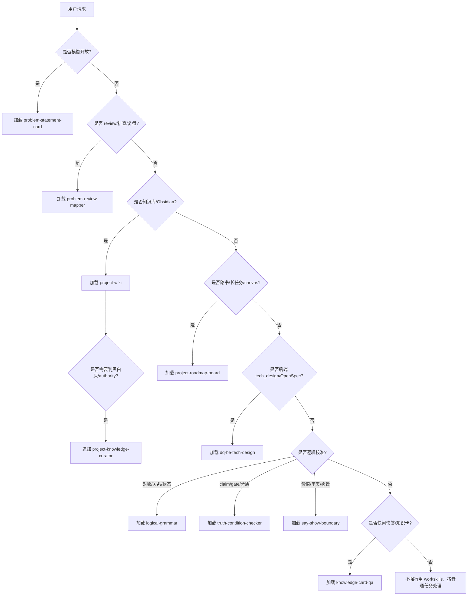

# Workskills Router

这是 `/Users/kim/code/workskills` 的唯一入口 skill。它不替代下游 skill，也不复制它们的规则；它只负责把用户请求路由到正确 skill，并控制上下文加载量。

## 核心规则

- 默认只选 **1 个主 skill**。
- 只有当主 skill 明确需要业务知识、路书、OpenSpec、卡片沉淀或引用校验时，才追加第二个 skill。
- 先读下游 skill 的 `SKILL.md`；只有触发到细节，才读 `references/*` 或运行 `scripts/*`。
- 不要一次性读取整个 `/Users/kim/code/workskills`。
- 三类逻辑审计先做分流，不在 router 里实现规则：
  - `logical-grammar`：对象 / 关系 / 状态 / 动作能不能合法组合。
  - `truth-condition-checker`：claim / node / gate / decision 什么条件下为真或为假。
  - `say-show-boundary`：事实命题与价值、审美、愿景、偏好边界。
- 当用户前提不成立时，必须提示纠正：说明旧说法为什么不成立、当前证据支持什么、下一步如何改，不要只顺着用户继续执行。

## 快速路由

| 用户在问什么 | 主 skill | 追加条件 |
|---|---|---|
| 问题模糊、方案太多、不踏实、好不好用/好不好看 | `problem-statement-card` | 需要证据校准时加 `problem-review-mapper` |
| review、排查、复盘、我感觉不对劲、画图、哪些对/不对 | `problem-review-mapper` | 涉及业务知识真伪时加 `project-wiki` + `project-knowledge-curator` |
| Obsidian、知识库、业务域、`#业务`、`[[功能点]]`、补文档、Knowledge Pack | `project-wiki` | 需要判能不能用时加 `project-knowledge-curator` |
| 黑白灰、authority、错知识退出、Conflict Verdict、Repair Loop | `project-knowledge-curator` | 需要实际查/写 vault 时加 `project-wiki` |
| 路书、canvas、进度板、长任务 Loop、子环、状态颜色同步 | `project-roadmap-board` | 涉及业务事实时加 `project-wiki` + `project-knowledge-curator` |
| OpenSpec、后端技术方案、`tech_design.md`、库表/schema、跨服务、架构评审 | `dq-be-tech-design` | 业务事实不清时加 `project-wiki`；执行图需要加 `project-roadmap-board` |
| 快问快答、说人话、知识卡、决策卡、是否落卡 | `knowledge-card-qa` | 先用对应取证 skill 得到证据，再压缩表达 |
| 对象/关系/状态/字段/任务拆分能不能这样连 | `logical-grammar` | 语法合法后再转 `truth-condition-checker` 或领域 skill |
| claim、gate、结论、验收口径是否成立，哪里矛盾 | `truth-condition-checker` | 需要事实证据时加 `problem-review-mapper` / `project-knowledge-curator` |
| “好/坏/高级/自然/有趣/方向正确”等价值或审美判断 | `say-show-boundary` | 开放问题加 `problem-statement-card`；决策表达加 `knowledge-card-qa` |

## 路由流程



## 组合加载

### 复杂 review / 排查

1. 读 `problem-review-mapper/SKILL.md`
2. 如果图里的 claim 涉及业务知识真伪，读 `project-wiki/SKILL.md`
3. 如果要判白/灰/黑或旧知识退出，读 `project-knowledge-curator/SKILL.md`
4. 用户要“说人话/落卡”时，再读 `knowledge-card-qa/SKILL.md`

### Obsidian 知识导读 / 写回

1. 读 `project-wiki/SKILL.md`
2. 结构问题才读 `project-wiki/references/vault-structure.md`
3. claim/span 引用校验才读 `project-wiki/references/obsidian-sourcecheck.md`
4. 三色治理才读 `project-knowledge-curator/SKILL.md`
5. Knowledge Pack 模板才读 `project-knowledge-curator/references/knowledge-pack-template.md`

Obsidian 知识身份顺序固定：

```text
业务域文件夹 -> #业务域 -> [[功能点]] -> claim_id/source_ref
```

`path + line` 只能做物理定位，不能当知识身份。

### 长任务 / 路书

1. 读 `project-roadmap-board/SKILL.md`
2. 建板、审计、颜色传播细节才读 `project-roadmap-board/rules.md`
3. 需要画法示例才读 `project-roadmap-board/examples.md`
4. 生成/校验 `.canvas` 优先运行 `layout.py` / `audit.py`
5. 涉及业务事实时追加 `project-wiki` + `project-knowledge-curator`

每轮 Loop 必须先回写 `.canvas` 再继续派工；新增任务链先落 runtime group，开始处理再建子环，颜色、edge、group label/color 同批同步。

### OpenSpec / 后端技术方案

1. 读 `dq-be-tech-design/SKILL.md`
2. 只在对应章节触发时读它的 references
3. 业务事实不清时追加 `project-wiki` / `project-knowledge-curator`
4. 如果方案要转执行闭环，再追加 `project-roadmap-board`

`tech_design.md` 是 OpenSpec change 的技术证据，不是业务知识库。

### 快问快答 / 知识卡

1. 先用实际任务 skill 取证、裁决或执行
2. 再读 `knowledge-card-qa/SKILL.md`

卡片不是权威源。Obsidian 知识卡必须能反查业务域、`#业务域`、`[[功能点]]`、`claim_id/source_ref`。

### 三类逻辑审计

1. 读 `logical-grammar/SKILL.md`：如果对象、关系、状态、动作没有成句，先改写，不进入真假验证。
2. 读 `truth-condition-checker/SKILL.md`：如果 claim / gate / decision 要成立，必须列出真值条件、证据、反例和矛盾。
3. 读 `say-show-boundary/SKILL.md`：如果用户或 agent 把价值、审美、愿景当事实说，先改写成取向、约束、可观察后果和代价。
4. 需要表达给用户时，追加 `knowledge-card-qa`；需要画证据链时，追加 `problem-review-mapper`；需要业务事实裁决时，追加 `project-knowledge-curator`。

纠正用户或 agent 前提时，用稳定句式：

```text
这里要纠正一下：<旧说法> 不成立。
当前证据支持的是 <新说法>。
后续按 <纠正动作> 走，<旧动作/旧说法> 不再作为默认上下文。
```

## 职责边界

| Skill | 负责 | 不负责 |
|---|---|---|
| `problem-statement-card` | 把开放问题压成可执行问题陈述 | 不替代取证、实现、知识治理 |
| `problem-review-mapper` | 图优先 review / 排查 / 复盘 / 多证据收敛 | 不维护业务知识真源 |
| `project-wiki` | Obsidian Query / Ingest / Lint / SourceCheck 工具层 | 不裁决黑白灰，不替用户拍板 |
| `project-knowledge-curator` | 三色知识、authority、Knowledge Pack、Repair Loop | 不直接写代码，不替代 vault IO |
| `project-roadmap-board` | Obsidian Canvas 路书、闭环工作块、Loop 状态事务 | 不托管业务事实 |
| `dq-be-tech-design` | 后端 `tech_design.md` 章节、评审、OpenSpec 技术证据 | 不做业务知识库 |
| `knowledge-card-qa` | 把已校验结论压成人话卡/决策卡 | 不制造新事实，不替代权威源 |
| `logical-grammar` | 判断对象/关系/状态/动作是否合法组合 | 不判断真假，不替代证据 |
| `truth-condition-checker` | 拆真值条件、找反例、找矛盾 | 不修语法错误，不处理纯价值判断 |
| `say-show-boundary` | 区分事实命题与价值/审美/愿景 | 不把偏好伪装成事实证据 |

## 反模式

- 用户没说业务域时直接写代码方案。
- 一开始把 `project-wiki`、`curator`、`roadmap`、`tech_design` 全读进来。
- 把 Obsidian 的 `path + line` 当成知识身份，跳过业务域、`#业务域`、`[[功能点]]`。
- 把 SourceCheck `ok` 当成白知识。
- 把 roadmap 当 PRD 摘要或 agent Todo。
- 把快问快答卡片当权威文档。
- 发现错知识后只在聊天里修正，不让旧知识退出默认上下文。
- 对象关系还没成句就开始查真假。
- 把未知真值条件默认当真。
- 把价值、审美、愿景包装成“已验证事实”。

## 入口口诀

```text
模糊先定问题；
语法不通先改句；
结论要写真值；
价值审美只 show 不伪装事实；
排查先画图；
知识先查 wiki；
能不能用交 curator；
长任务上 roadmap；
后端设计写 tech_design；
最后才压快问快答。
```
